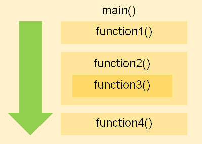
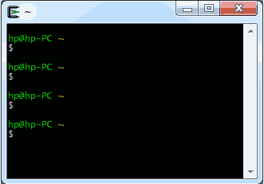
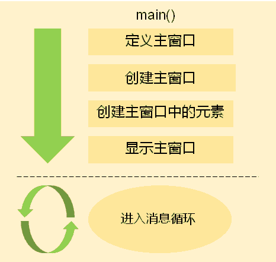
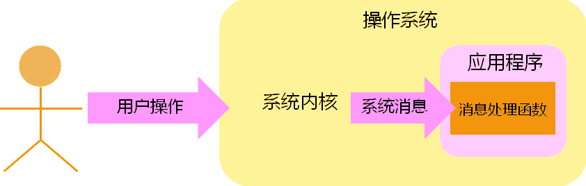
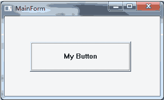
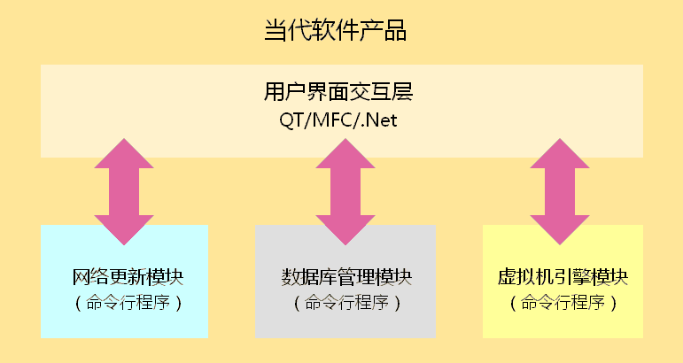

# 1. 命令行应用程序
## 1.1. 命令行应用程序的特点(Command Line Interface )
- 是一种<font color=red>基于顺序执行结构</font>的可执行程序
- 程序执行过程中<font color=red>不需要与用户产生交互</font>
- 程序执行后给出<font color=red>最终的</font>运行结果
```
gcc a.c b.c c.c
```
> 编译过程中不产生用户交互，编译结束后，生成可执行程序或者给出错误信息

## 1.2. 命令行应用程序的运行模式


- 特点
    - 程序的运行有固定的开始和固定的结束。

## 1.3. 命令行应用程序适用于


- <font color=red>单任务</font>场合
- <font color=red>无交互</font>或<font color=red>简单交互</font>场合
- <font color=red>服务器应用</font>场合
> <font color=red>命令行应用程序</font>是<font color=red>早期计算机系统</font>中的<font color=red>主要程序类型</font>。

# 2. 图形界面应用程序
## 2.1. 图形界面应用程序的诞生
- 随着计算机技术的发展，计算机走进日常生活
- 计算机程序开始<font color=red>需要处理各个领域中的问题</font>
- 计算机用户已经<font color=red>不再是专业的计算机工作者</font>
> 问题
> 如何让计算机程序更好的适应普通用户并走进日常生活？

## 2.2. 图形界面应用程序的特点(Graphic User Interface )
- 是一种<font color=red>基于消息驱动模型</font>的可执行程序
- 程序的执行<font color=red>依赖于用户的交互过程</font>
- 程序执行过程中<font color=red>实时响应用户操作</font>
- 一般情况下<font color=red>程序执行后不会主动退出</font>

## 2.3. 图形界面应用程序的运行模式


## 2.4. 图形界面应用程序的消息处理模型


## 2.5. 图形界面应用程序适用于


- 多任务的场合
- 强用户交互的场合
- 非专业计算机用户
> 图形界面应用程序是当代计算机系统中的主要程序类型。

# 3. 图形界面程序VS命令行程序
- 当代大型软件产品架构模型


# 4. 小结
|  命令行应用程序  | 图形界面应用程序 |
| --------------- | --------------- |
| 基于顺序执行结构 | 基于消息驱动模型 |
| 弱交互执行       | 强交互执行       |
| 由用户触发运行   | 由用户触发运行   |
| 主动结束         | 由用户触发结束   |
