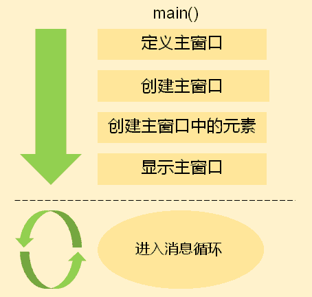
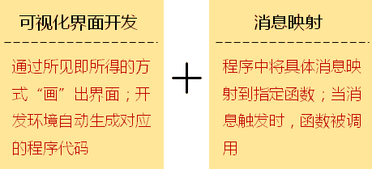

# 1. GUI程序开发概述
- 现代操作系统<font color=red>支持GUI界面</font>
    - 现代操作系统<font color=red>提供原生SDK支持GUI程序开发</font>
    - <font color=red>GUI程序开发</font>是现代操作系统上的主流技术
    - 不同操作系统上的<font color=red>GUI开发原理相同</font>
    - 不同操作系统上的<font color=red>GUI SDK不同</font>

# 2. GUI程序开发原理
- GUI程序在运行时会<font color=red>创建一个消息队列</font>
- 系统内核将<font color=red>用户操作</font>翻译成对应的<font color=red>程序消息</font>
- 程序在<font color=red>运行过程</font>中需要<font color=red>实时处理队列中的消息</font>
- 当队列中<font color=red>没有消息</font>时,程序将处于<font color=red>停滞状态</font>

- 不同操作系统<font color=red>支持相同的GUI开发原理</font>


伪代码：
```c
int main()
{
    fd = DefineMainWindow();
    win = CreateMainWindow(fd);
    CreateElements(win);
    DisplayMainWindow(win);
    while (GetMessage(&msg)) {
        //Send. msg to win
    )
    return 0;
)
```

# 3. GUI程序开发的本质
- GUI程序开发：
    - 在代码中用<font color=red>程序创建窗口及窗口元素</font>
    - 在消息处理函数中<font color=red>根据程序消息做出不同响应</font>
    > 经典GUI程序开发模式
    > 

# 4. GUI程序开发实例
- 多数操作系统以<font color=red>C函数的方式提供GUI SDK</font>
- 以<font color=red>Windows</font>操作系统为例：

|      函数名       |                           功能                           |
| ---------------- | -------------------------------------------------------- |
| RegisterClass    | 向系统注册GUI窗口式样<br>（让操作系统知道自己定义的主窗口） |
| CreateWindow     | 创建窗口或窗口元素                                        |
| ShowWindow       | 在屏幕上显示创建好的窗口                                   |
| UpdateWindow     | 刷新屏幕上的窗口                                          |
| GetMessage       | 获取程序消息队列中的消息                                   |
| TranslateMessage | 翻译系统消息                                              |
| DispatchMessage  | 将消息发送到窗口处理函数                                   |

# 5. 编程实验 GUI程序开发初体验 GUIDemo.sIn
- 代码方式
    - 代码
        - [main_form.cpp](vx_attachments\002_GUI_Program_example_analysis_visual_studio\test\main.cpp)
    - 工具
        - visual studio 2010
    - 步骤
        - 新建->项目->空项目
        - 添加cpp源文件，编译运行
        > 注:右键项目->属性->配置属性->常规->字符集->使用Unicode字符集

- mfc工程简介
    - 新建项目->MFC->MFC应用程序->命名->确定->下一步->应用程序类型（基于对话框）->下一步->下一步->下一步->完成
    - 工具箱拖拽按钮到Dialog
    - 右键按钮->属性->可更改ID和caption
    - 右键按钮->类向导->选中自己设置的按钮ID->选中BN_CLICKED->添加处理程序->确定
    - 成员函数中新增项，双击定位到函数处，编写消息处理函数
    ```c
    MessageBox(L"MyButton is clicked!");
    ```

# 6. 小结
- 现代操作系统<font color=red>提供原生SDK支持GUI程序开发</font>
- 不同操作系统上的<font color=red>GUI SDK不同</font>
- 不同操作系统上的<font color=red>GUI开发原理相同</font>
- GUI程序开发包括
    - 在代码中用<font color=red>程序创建窗口及窗口元素</font>
    - 在消息处理函数中<font color=red>根据程序消息做出不同响应</font>
