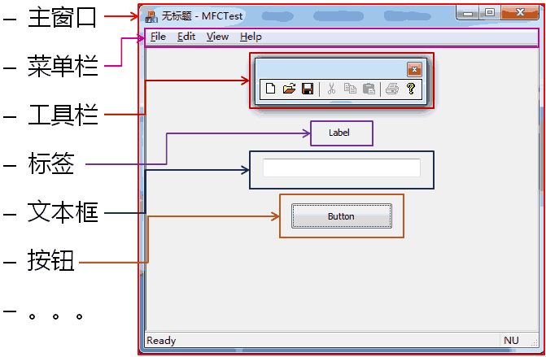
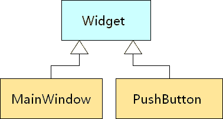

# 1. GUI用户界面元素
- GUI用户界面是由固定的窗口元素所构成的
    
    - 操作系统提供了创建用户界面元素所需要的函数
    - 各种功能不同的函数依次调用，从而创建出界面元素
    - 操作系统提供的原生函数无法直接映射到界面元素
    > 如何直观的将界面元素的概念直接映射到程序中?

# 2. 面向对象的GUI程序设计
- GUI应用程序是为解决非科学计算问题而诞生的
- GUI应用程序适用于非专业的日常生活领域
- 面向过程程序设计方法学不适合GUI程序设计
- 面向对象程序设计方法学更适合GUI程序设计

# 3. 另一种角度
- 用面向对象方法学看待GUI界面元素
- 所有的界面元素都可以看作实际的对象
- GUI用户界面是由各不相同的对象组成的
    - 主窗口对象
        - 菜单对象
        - 钮对象
        - 文本框对象
        - 。。。

- 用面向对象的思想开发GUI应用程序，考虑的问题
    - 主界面上有哪些界面元素?
    - 程序中需要几个对话框？
    - 这些类都已经支持了吗？还是需要另外开发？
    - 需要的界面元素都对应明陛类?

- GUI开发非常适合采用面向对象方法学
    - 将界面元素定义为对应的类
    - 通过抽象和封装可以隐藏界面元素的细节
    - 程序的创建过程就是组合不同界面元素对象的过程
    

# 4. 实例分析 面向对象的方法创建GUI程序 GUIDemoEx.sIn

# 5. QT的本质
- QT是利用面向对象方法学开发的一套GUI组件库
- QT将不同操作系统的GUI细节封装于类的内部
- QT提供一套跨平台的类用于开发GUI程序
- QT遵循经典的GUI应用程序开发模式

# 6. 小结
- GUI程序开发更适合采用面向对象方法学
- 所有的界面元素都可以看作实际的对象
- GUI用户界面是由各不相同的对象组成的
- QT是利用面向对象方法学开发的一套GUI组件库
- QT将GUI细节封装于类的内部，具有跨平台的特性
