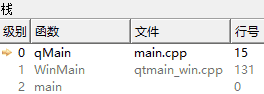
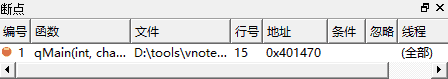
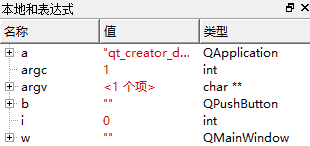

# 1. QT是什么?
- QT是一套跨平台的GUI开发库（狭义）
- QT是一套 C++ 集成开发环境（广义）
    > 数据结构（链表，队列，...），多线程，网络，数据库
- QT是一套开源的殿堂级架构技术教程

# 2. 编译
## 2.1. 通过命令行的方式编译QT源程序
### 2.1.1. 步骤
- 启动QT命令行
- 进入源程序所在目录
- 命令：
    1. `qmake -project` // 根据目录中的源码生成工程文件
        > 生成对应的工程文件：xxx.pro
    2. `qmake` // 根据工程文件生成makefile文件
        > 生成Makefile文件
    3. `make` // 根据makefile进行编译
        > 生成可执行程序

### 2.1.2. 编程实验 编译和运行第一个QT程序
代码：[main.cpp](vx_attachments\004_qt_compile_and_debug\cmdline_compile\main.cpp)
> 使用QT的命令行 或 将QT的bin路径添加到环境变量，打开普通的cmd。

## 2.2. IDE方式编译
### 2.2.1. QT Creator简介
- QT Creator 是一套可视化的集成开发环境
    - 使用 QT Creator 可以高效的进行QT开发
        - QT Creator 提供了强大的代码编辑功能
        - QT Creator 提供了强大的调试功能

### 2.2.2. 调式的基本方法
- Log调式法
    - 在代码中加入一定的打印语句
    - 打印程序状态和关键变量的值
    > `#include <QDebug>`
    > `qDebug() <<`

- 断点调式法
    - 在开发环境中的对应代码行加上断点
    - 当程序运行到断点行时，程序暂停运行
    - 需要时课加上条件断点，当条件满足才暂停程序的运行
    > 查看函数调用栈，局部变量值。。。

### 2.2.3. 编程实验 QT Creator 使用初体验
代码：[main.cpp](vx_attachments\004_qt_compile_and_debug\qt_creator_debug\main.cpp)

1. 使用前面命令行方式的`qmake -project`生成工程文件（xxx.pro）。
2. 使用 QT Creator 打开该工程文件，点击完成。
3. 构建->构建所有项目（编译输出中查看编译结果）
4. 调试->开始调试->开始调试
    > 应用程序输出中打印`qDebug()`调试语句
5. 重新开始调试。设置断点：在行号处右键设置断点
    > 1. 查看函数调用栈（调用了WinMain）
    > 
    > 2. 断点信息
    > 
    > 3. 局部变量的值
    > 
6. 继续运行（F5），可发现局部变量i的值改变
7. 调试过程可移除断点和新增断点
8. 重新开始调试。设置条件断点：在第15行添加断点->在断点上右键->编辑断点->弹出对话框中，条件填写 `i == 7` ->确定。（当运行到i ==7的时候，才会在15行的断点处停止）
9. 开始调试，查看局部变量i = 7

# 3. 小结
- QT是一套跨平台的C++界面开发库
- 可以通过命令行的方式开发QT应用程序
- 也可以通过QT Creator进行QT开发
- QT Creator同时支持Log调式法和断点调试法
