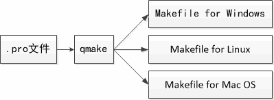

# 1. Qt Creator工程管理
- Qt Creator以工程项目的方式对源码进行管理
- 一个Qt Creator工程包含不同类型的文件
    - <mark>.pro项目描述文件</mark>
    - .pro.user用户配置描述文件
        > Qt Creator 自动生成的。如果我们的Qt Creator工程需要在不同的电脑之间进行拷贝的时候，这个文件是可以删除掉的。
    - .h头文件
    - .cpp源文件
    - .ui界面描述文件
        > Qt Creator提供可视化的方式让我们拖画出用户界面，对应的文件就是.ui界面描述文件。后续讲解到如何使用Qt designer设计GUI用户界面的时候会详细介绍。
    - 资源文件（图片，音频，等）

# 2. .pro项目描述文件
-  .pro项目描述文件的基本构成
    - `#` - 注释起始符
    - `QT` - 模块声明
        > 当前QT项目需要用到哪些模块
    - `TARGET` - 可执行文件名
    - `TEMPLATE` - 程序模板声明
        > 当前需要编译的是个可执行程序还是动态链接库还是静态链接库
    - `SOURCES` - 源码文件声明
    - `HEADERS` - 头文件声明
    - `FORMS` - 界面文件声明
        > 窗体，.ui界面描述文件
    - `RC_FILE` - 资源文件声明
- .pro项目描述文件中的高级变量
    - `INCLUDEPATH` - 头文件搜索路径
    - <mark>`CONFIG` - 设定项目的配置信息和编译选项</mark>
    - `LIBS` - 添加第三方库文件
    - `DEFINES` - 定义编译宏
- .pro文件的本质
    
    > .pro文件的本质为Qt中的Makefile文件！

# 3. CONFIG配置
- CONFIG用于设定项目的配置信息和编译选项
- CONFIG的常用选项
    - debug - 构建debug版本的可执行程序
    - release - 构建release版本的可执行程序
    - debug_and_release - 同时构建 debug 版和 release 版
    - warn_on - 尽可能多的输出警告信息
    - warn_off - 不输出警告信息

# 4. 实例分析 .pro项目文件分析 
.pro文件：[demo.pro](vx_attachments\005_qt_creator_engineering_file\demo.pro)

# 5. 项目文件
- 一般来说，项目文件中的描述都使用相对路径
- 而相对路径是相对于项目文件本身而言
- Qt Creator将项目文件作为目标文件
    > 注意：
    > 1. Qt Creator在打开项目文件的同时会生成.pro.user文件
    > 2. .pro.user文件包含一些与Qt相关的本地配置信息
    > 3. 当需要在不同计算机之间移动项目源码时，建议删除.pro.user文件

# 6. 工程中的概念
- 构建（build）
    - 对项目中的所有文件进行编译，最终生成可执行程序

- Debug版
    - 可以进行程序调式的构建版本
    - 可执行程序中包含调式信息，运行效率不高

- Release 版
    - 最终发布的应用程序构建版本
    - 无调式信息，运行效率高

# 7. 编程实验 Qt Creator项目创建及分析
工程目录：[HelloWorld](vx_attachments\005_qt_creator_engineering_file\HelloWorld)

- 新建工程 HelloWorld
    - 打开 QtCreator -> 创建项目 -> QT控件项目 -> QT Gui应用
    - 选择基类为QMainWindow
    > 构建的项目生成的中间文件和可执行文件均会自动放到另一个目录

- 调试:
    单步跳过：执行到断点后，执行下一条语句
    单步进入：执行到断点后，若当前行有函数调用的话，就进入函数的内部

# 8. 小结
- Qt Creator以工程项目的方式对源码进行管理
- 一个Qt Creator工程包含不同类型的文件
- .pro文件用于配置和组织整个项目的相关信息
- .pro文件是Qt中与平台无关的Makefile文件
- Qt Creator提供了开发所必备的快捷高效的功能
