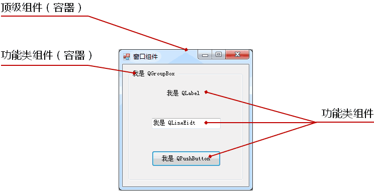
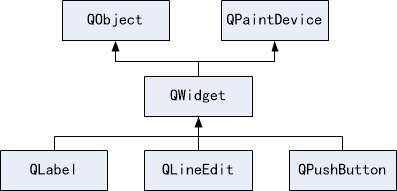
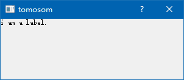
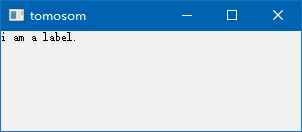
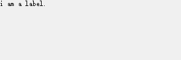

# 1. 窗口组件
- 图形用户界面由不同的<font color=red>窗口</font>和<font color=red>窗口组件</font>构成
- `<QtGui>`头文件包含窗口组件，<font color=red>对应Qt中的GUI模块</font>
    > 以类的方式存在
- Qt以<font color=red>组件对象</font>的方式<font color=red>构建图形用户界面</font>
- 组件的类型：
    - <font color=red>容器类（父组件）</font>：用于包含其它的界面组件
        > 与数据结构中涉及的容器类不同，数据结构中所谓的容器类指的是链表、队列、栈这样的数据结构
    - <font color=red>功能类（子组件）</font>：用于实现特定的交互功能
        > 比如：按钮，标签，文本框
    - Qt中没有父组件的顶级组件叫做<font color=red>窗口</font>
        > 窗口的概念包含了对话框，对话框是个特殊的窗口。

    
> QT中比较重要的隐藏概念 : Qt中没有父组件的顶级组件叫做窗口(也就拥有了窗口的所有元素:标题栏,最大化,最小化,关闭按钮)

# 2. 组件是如何构建起来的？
- QWidget 类继承自 <font color=red>QObject</font> 类和 <font color=red>QPaintDevice</font> 类
    - QObject是所有<font color=red>支持Qt对象模型</font>的基类
        > 所有组件都继承自最顶层的QWidget类
        > 除此处使用多继承外，其他基本都遵循单继承。
    - QPaintDevice是Qt中所有<font color=red>可绘制组件</font>（可自绘）的基类



# 3. QWidget 组件
## 3.1. 简介
- QWidget能够<font color=red>绘制自己</font>和<font color=red>处理用户的输入</font>
- QWidget是Qt中所有窗口组件类的父类（<font color=red>super class</font>）
- QWidget是<font color=red>所有窗口组件的抽象</font>
- Qt中的<font color=red>每个窗口组件都是一个QWidget</font>
- QWidget类对象常作为<font color=red>父组件</font>或<font color=red>顶级组件</font>使用

## 3.2. 编程实验 QWidget 初探
原始工程：[qwidget](vx_attachments\006_window_components_and_window_types\qwidget)
工程目录：[Test](vx_attachments\006_window_components_and_window_types\Test)

- 新建工程 Test
    - 打开 QtCreator -> 创建项目 -> QT控件项目 -> QT Gui应用
    - 选择基类为QWidget，取消勾选'创建界面'
        > 需知道如何直接用QT提供的类来手把手地生成图形用户界面，而不需用拖画的方式来生成。
        > 后面讲解如何使用拖画的方式。

# 4. QLabel组件
## 4.1. 简介
- QLabel用于<font color=red>显示</font>一个提示性的<font color=red>字符串</font>
- QLabel是<font color=red>功能性组件</font>，一般<font color=red>需要父组件作为容器</font>
- QLabel可以作为窗口存在，<font color=red>但没什么意义</font>

```c
QWidget w; // 生成QWidget对象，顶级组件
QLabel l(&w); // 生成 QLabel 对象，其父组件为 QWidget

/*设置QLabel组件的显示字符串*/
l.setText ( "This is a Label control.");
```

## 4.2. 编程实验 QLabel组件的使用
工程目录：同 3.2节 QWidget 实验

# 5. 窗口类型
- Qt中可以根据需要定制窗口式样
    - <font color=red>窗口类型</font>
        - Qt::Dialog - 对话框类型
        - Qt::Window - 主窗口类型
        - Qt::SplashScreen - 启动画面类型
        - ......
        > 搜索帮助：`Qt::WindowType`
    - <font color=red>窗口标志</font>
        - Qt::WindowStaysOnTopHint
            > 窗口总在最前显示，将该窗口作为顶级窗口,不会被其他窗口遮挡
        - Qt::WindowContextHelpButtonHint
            > 最大化和最小化按钮转化为帮助按钮，窗口类型最终效果与`Qt::Dialog`一样。
        - ......
        > `QWidget w(NULL, Qt::Window|Qt::WindowStaysOnTopHint|Qt::WindowContextHelpButtonHint);`
        > 搜索帮助：`Qt::WindowFlags`

# 6. 编程实验 窗口类型与窗口标志
查看帮助, QWidget 的构造函数：`QWidget ( QWidget * parent = 0, Qt::WindowFlags f = 0 )`
## 6.1. 窗口类型区别
- 对话框（Dialog）
    `QWidget w(NULL, Qt::Dialog);`
    
    > 无最大化和最小化按钮

- 窗口（Window）
    `QWidget w(NULL, Qt::Window);`
    

- 启动画面（SplashScreen ）
    `QWidget w(NULL, Qt::SplashScreen);`
    
    > 无标题栏

# 7. 小结
- Qt以<font color=red>组件对象</font>的方式<font color=red>构建图形用户界面</font>
- QWidget类是所有<font color=red>用户界面组件的父类</font>
- QWidget类对象常作为<font color=red>父组件</font>或<font color=red>顶级组件</font>使用
- Qt中可以根据需要<font color=red>定制窗口式样</font>
- QLabel用于<font color=red>显示</font>一个提示性的<font color=red>字符串</font>
