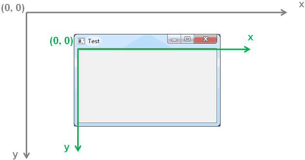
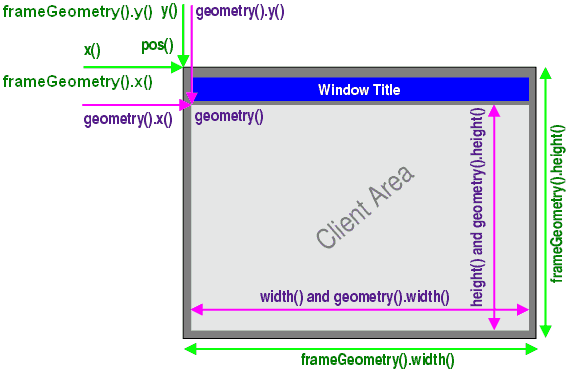

# 1. 坐标系统简介
- <font color=red>GUI</font>操作系统都有特定的<font color=red>坐标系统</font>
- 图形界面程序<font color=red>在坐标系统中进行窗口和部件的定位</font>
- 定位类型
    - 顶级窗口部件的定位
    - 窗口内部件的定位
    - 窗口部件的大小设置
- Qt使用<font color=red>统一的坐标系统</font>定位窗口部件的<font color=red>位置</font>和<font color=red>大小</font>
- Qt部件类提供<font color=red>成员函数</font>在坐标系统中进行定位
- QWidget类<font color=red>提供</font>了窗口部件所需的<font color=red>坐标系统成员函数</font>

> 屏幕和窗口内部坐标系统

# 2. 坐标系统相关的成员函数
- `QWidget w;`的3组坐标系统成员函数
    - `w`
        - `x(), y(), width(), height()`
    - `w.geometry()`
        - `x(), y(), width(), height()`
    - `w.frameGeometry()`
        - `x(), y(), width(), height()`
    > `x()、y()` 均是相对于屏幕的坐标
    > `w.x()、w.y()` 和 `w.frameGeometry().x()、w.frameGeometry().y()` 是一样的
    > `w.width()、w.height()` 和 `w.geometry().width()、w.geometry().height()` 是一样的


> 问：为什么QT在坐标系统相关的函数里面，要提供3组不同的函数出来
> 答：为了兼容跨平台，不同的平台中窗口的外观式样不一样。

- <font color=red>注意事项</font>
geometry() 和 frameGeometry() 中的几何数据必须在 show() 调用后才有效！ ！ ！
> 原因：因为QT的目标要跨平台，不同的目标平台窗口的外观样式有差异，在程序真正运行，窗口出现之前，写这段代码时，不能确定代码在什么平台上编译，因此，QT在窗口显示出来之前无法得到真实有效的几何数据。

# 3. 编程实验 Qt坐标系统初探
工程目录：[Test](vx_attachments\007_coordinate_system_in_QT\Test)

- 新建工程 Test
    - 打开 QtCreator -> 创建项目 -> QT控件项目 -> QT Gui应用
    - 选择基类为QWidget，取消勾选'创建界面'

> 当我们设置的宽度如果小于操作系统所需要满足的最小宽度时，会以操作系统对窗口规定的最小宽度来取代设定的值。高度没有限制。

# 4. 窗口部件的大小设置
- QWidget类提供了<font color=red>成员函数</font>：
    - <font color=red>改编窗口部件的大小</font>
        - void resize(int w, int h )
        - void resize(const QSize &)
    - <font color=red>改编窗口部件的位置</font>
        - void move (int x, int y )
        - void move (const QPoint &)

# 5. QPushButton 组件
- QPushButton 用于<font color=red>接受用户点击事件</font>
- QPushButton 能够<font color=red>显示提示性字符串</font>
- QPushButton 是<font color=red>功能性组件，需要父组件作为容器</font>
- QPushButton 能够<font color=red>在父组件中进行定位</font>

```c
QWidget w;           // 生成QWidget对象，顶级组件
QPushButton b(&w);   // 生成 QPushButton对象，其父组件为 QWidget

b.setText("Button"); // 设置显示的字符串
b.move(10, 10);      // 移动到坐标(10, 10)
b.resize(100, 25);   // 设置大小 width = 100, height = 25
```

# 6. 编程实验 窗口子组件的大小和位置
工程目录：同第3节

# 7. 小结
- Qt中的几何坐标以<font color=red>左上角为原点</font>
    - 水平为x轴，从左向右为正向
    - 垂直为y轴，从上到下为正向
- Qt中的GUI组件以<font color=red>左上角进行定位</font>
- Qt中的GUI组件可以在<font color=red>坐标系统中进行大小设置</font>
