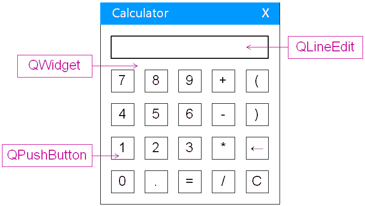
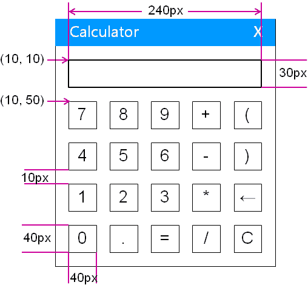

# 1. 计算器程序界面分析


# 2. QLineEdit 组件
- QLineEdit 用于<font color=red>接受用户输入</font>
- QLineEdit 能够<font color=red>获取用户输入的字符串</font>
- QLineEdit 是<font color=red>功能性组件</font>，<font color=red>需要父组件作为容器</font>
- QLineEdit 能够<font color=red>在父组件中进行定位</font>

```c
QWidget w;        // 生成生成 QWidget 对象，顶级组件对象，顶级组件
QLineEdit le(&w); // 生成生成 QLineEdit 对象，其父组件为对象，其父组件为 QWidget

le.setAlignment(Qt::AlignRight); // 设置显示的字符串向右边对齐
le.move(10, 10);                 // 移动到坐标移动到坐标(10, 10)
le.resize(240, 30);              // 设置大小设置大小 width = 240, height = 30
```

# 3. 设计与实现
- 界面设计
    - 定义<font color=red>组件间</font>的间隔
        - Space = 10px
    - 定义<font color=red>按钮组件</font>的大小
        - Width = 40px
        - Height = 40px
    - 定义<font color=red>文本框组件</font>的大小
        - Width = 5 * 40px + 4 * 10px
        - Height = 3Opx
    

# 4. 编程实验 计算机器界面实现
工程目录：[Calculator](vx_attachments\008_calculator_interface\Calculator)

- 新建工程 Calculator
    - 打开 QtCreator -> 创建项目 -> QT控件项目 -> QT Gui应用
    - 选择基类为QWidget，取消勾选'创建界面'
    - 删除 QtCreator 为我们自动生成的头文件 widget.h 和源文件 widget.cpp

- 优化
    - 计算器程序不需要最大化和最小化按钮
        `QWidget *w = new QWidget(NULL, Qt::WindowCloseButtonHint);`
    - 计算器程序的窗口应该是固定大小
        `w->setFixedSize(w->width(), w->height());`
    - 文本框不能直接输入字符
        `le->setReadOnly(true);`

# 5. 小结
- GUI应用程序开发应该前<font color=red>必须先进行界面设计</font>
- GUI应用程序界面<font color=red>需要考虑各个细节</font>
    - <font color=red>界面决定最终用户的体验</font>
    - <font color=red>界面细节是GUI应用程序品质的重要体现</font>
- Qt库<font color=red>有能力实现</font>各种GUI应用程序需求
- <font color=red>Qt帮助文档</font>的使用对于开发是<font color=red>非常重要</font>的
