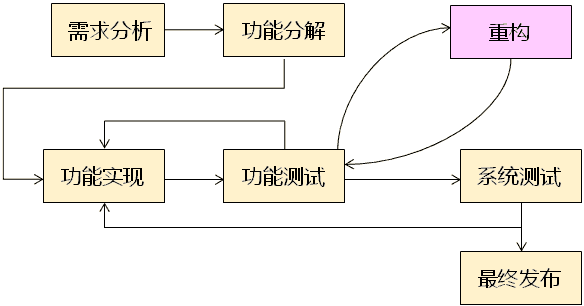
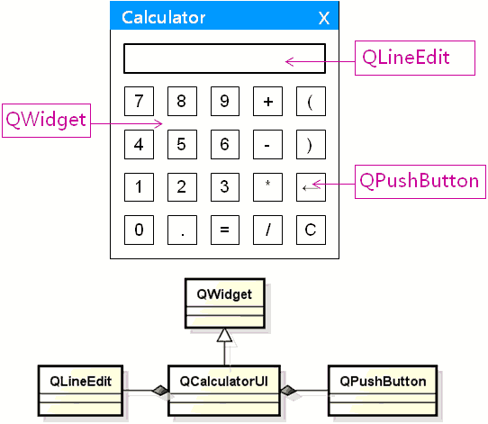

# 1. 重构
## 1.1. 重构的概念
- 重构(Refactoring )
    - 以改善代码质量为目的代码重写
        - 使其软件的设计和架构更加合理
        - 提高软件的扩展性和维护性

## 1.2. 重要的差异
- 代码实现与代码重构不同
    - 代码实现
        - 按照设计编程实现，重心在于功能实现
    - 代码重构
        - 以提高代码质量为目的软件架构优化
    > 区别：
    > 代码实现时不考虑架构的好坏，只考虑功能的实现
    > 代码重构时不能影响已实现的功能，只考虑架构的改善

## 1.3. 如何开发软件?
- 软件开发过程
    - 从工程的角度对软件开发中的活动进行定义和管理
    

## 1.4. 值得思考的问题
- 什么样的代码需要重构？
    - 当发现项目中重复的代码越来越多时
    - 当发现项目中代码功能越来越不清晰时
    - 当发现项目中代码离设计越来越远时
    - ...

> 重构是维持代码质量在可接受范围内的重要方式
> 重构的时机和方式由项目组使用的软件开发过程(Process)决定

# 2. 计算器界面代码重构

继承QWidget
组合QLineEdit, QPushButton

# 3. 编程实验 计算器界面代码重构
工程目录：[Calculator](vx_attachments\009_calculator_interface_refactoring\Calculator)

基于上一章的代码进行优化
右键'源文件' -> 添加新文件 -> c++（文件和类）-> c++类 -> 选择 -> 输入类名，选择基类QWidget -> 下一步 -> 完成

## 3.1. 二阶构造介绍
https://blog.csdn.net/lms1008611/article/details/81411413

# 4. 小结
- 重构是软件开发中的重要概念
- 重构是以提高代码质量为目的的软件开发活动
- 重构不能影响已有的软件功能
- 当软件功能的实现进行到了一定阶段时就需要考虑重构
- 重构可简单的理解为对软件系统进行重新架构
