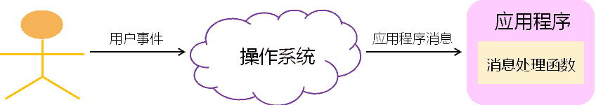
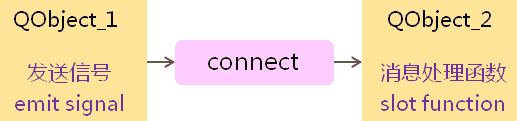

# 1. Qt消息模型
- Qt<font color=red>封装</font>了具体操作系统的<font color=red>消息机制</font>
- Qt<font color=red>遵循</font>经典的GUI<font color=red>消息驱动事件模型</font>


# 2. 思考
- Qt中如何表示用户消息？
- Qt中如何映射用户消息到消息处理函数？
- Qt中消息映射需要遵循什么规则？

# 3. 信号与槽
- Qt中定义了与系统消息相关的概念
    - 信号(Signal)
        - 由操作系统产生的消息
    - 槽(Slot)
        - 程序中的消息处理函数
    - 连接(Connect)
        - 将系统消息绑定到消息处理函数
    > Qt 中定义了与系统消息相关的概念, Qt 为了做到真正的跨平台,摒弃了一些具体的操作系统平台上面关于用户消息及消息处理函数的概念,完全不用现成的操作系统中的概念,另起炉灶,有了自己的一套概念

- Qt中的消息处理机制

> 信号到槽的连接必须发生在两个Qt类对象之间！

- Qt 的<font color=red>核心</font> - `QObject::connect` 函数

```c
bool connect(const QObject *sender,   //发送对象
             const char *signal,      //消息名
             const QObject *receiver, //接收对象
             const char *method,      //接受对象的成员函数
             Qt::ConnectionType type = Qt::Autoconnection);
```
> Note :
> 在Qt中，消息用<font color=red>字符串</font>进行描述
> connect函数在<font color=red>消息名</font>和<font color=red>处理函数</font>之间<font color=red>建立映射</font>

- Qt中的“新”关键字
    - SIGNAL
        - 用于指定消息名
    - SLOT
        - 用于指定消息处理函数名
    - Q_OBJECT
        - 所有自定义槽的类<font color=red>必须叫声明的开始处加上Q_OBJECT</font>
    - slots
        - 用于在类中<font color=red>声明消息处理函数</font>

# 4. 编程实验 初探信号与槽
工程目录：[Test](vx_attachments\010_simple_message_handler\Test)

# 5. 自定义槽
- 只有<font color=red>QObject</font>的子类才能<font color=red>自定义槽</font>
- 定义槽的类必须<font color=red>在声明的最开始处使用Q_OBJECT</font>
- 类中<font color=red>声明槽</font>时需要使用<font color=red>slots</font>关键字
- <font color=red>槽</font>与所处理的<font color=red>信号</font>在<font color=red>函数签名上必须一致</font>
    > 信号的名字其实是函数的签名,也就是信号函数和定义的信号处理函数的形参要保证完全一致
- <font color=red>SIGNAL</font>和<font color=red>SLOT</font>所指定的名称中：
    - <font color=red>可以包含参数类型</font>
    - <font color=red>不能包含具体的参数名</font>

# 6. 编程实验 为计算器实例添加消息处理函数
工程目录：[Calculator](vx_attachments\010_simple_message_handler\Calculator)

> 添加信号与槽相关内容后,代码编译错误,重新构建所有项目依然错误,需执行qmake重新生成Makefile编译
后面深入讲解信号与槽时解释,这个与QT平台本身的实现机制相关

# 7. 小贴士
- 解决经典问题：<font color=red>Object::connect: No such slot...</font>
    1. 检查类<font color=red>是否继承于QObject</font>
    2. 检查类声明的开始处<font color=red>是否添加Q_OBJECT</font>
    3. 检查<font color=red>是否使用slots关键字进行槽声明</font>
    4. 检查<font color=red>槽的名称是否拼写错误</font>
    5. <font color=red>重新执行qmake</font>

# 8. 小结
- <font color=red>信号与槽</font>是Qt中的<font color=red>核心机制</font>
- 不同的Qt对象可以<font color=red>通过信号和槽进行通信</font>
- 只有<font color=red>QObject</font>的子类才能<font color=red>自定义信号和槽</font>
- 使用信号和槽的类必须在<font color=red>声明的最开始处使用QOBJECT</font>
- <font color=red>信号</font>与处理函数在<font color=red>函数签名上必须一致</font>
