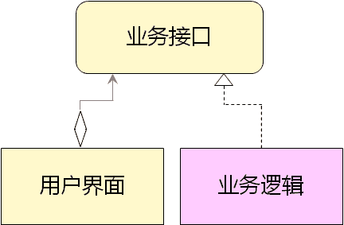
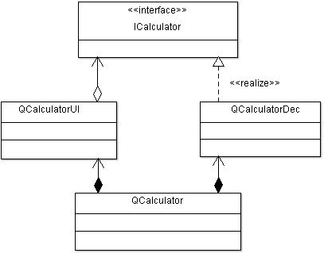

# 1. 界面与逻辑
- 基本程序架构一般包含：
    - 用户界面模块（UI）
        - 接受用户输入及呈现数据
    - 业务逻辑模块（Business Logic）
        - 根据用户需求处理数据

# 2. 基本设计原则
- 功能模块之间需要进行解耦
- 核心思想：强内聚，弱耦合
    - 每个模块应该只实现单一的功能
    - 模块内部的子模块只为整体的单一功能而存在
    - 模块之间通过约定好的接口进行交互

- 在工程开发中接口是什么？
    - 广义：
        - 接口是一种契约（协议，语法，格式，等）
    - 狭义：
        - 面向过程：接口是一组预定义的函数原型
        - 面向对象：接口是纯虚类（C#和Java直接支持接口）

- 用户界面与业务逻辑的交互

> 用户界面使用`业务接口`，业务逻辑（核心算法）实现`业务接口`
> 定义好业务接口后，两个模块（用户界面和业务逻辑）可实现并行开发

- 基本设计原则
    - 模块之间仅通过接口进行关联
        - 必然存在模块会使用接口
        - 必然存在模块实现对应的接口
    - 模块间的关系是单项依赖的
        - 避免模块间存在循环依赖的情况
        - 循环依赖是糟糕设计的标准之一

- 计算器应用程序的整体架构

# 3. 编程实验 计算器程序集成测试
工程目录：[Calculator](vx_attachments\015_Separation_of_user_interface_and_business_logic\Calculator)
接口头文件：添加c++头文件 -> `ICalculator.h`
新增类，将`QCalculatorUI`和`QCalculatorDec`联系在一起：`QCalculator.cpp，QCalculator.h`

# 4. 小结
- 模块之间的交互需要通过接口完成
- 接口是开发中模块之间的一种"契约"
- 模块之间不能出现循环依赖
- 基本设计原则：强内聚，弱耦合
