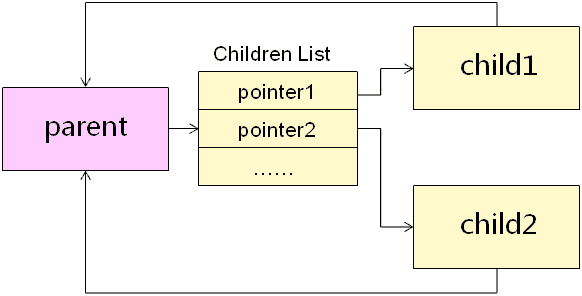
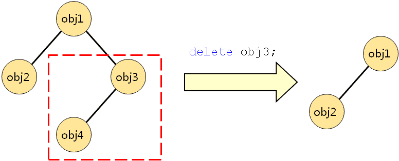

# 1. 这是一个bug吗?
QCalculatorUI类对象<font color=red>在堆空间中创建</font>了文本框和按钮，但<font color=red>没有对应的delete代码</font>，内存泄漏！ ！ ！
> 答：NO！

# 2. Qt对象间的关系
- Qt对象间可以存在父子关系
    - 每一个对象都保存有它所有子对象的指针
    - 每一个对象都有一个指向其父对象的指针
    

- 当指定Qt对象的父对象时
    - <font color=red>其父对象会在子对象链表中加入该对象的指针</font>
    - <font color=red>该对象会保存指向其父对象的指针</font>

```c
QObject *p = new QObject();
QObject *cl = new QObject();
QObject *c2 = new QObject();

cl->setParent(p);
c2->setParent(p);
```

# 3. 编程实验 对象间的父子关系
代码路径：[Test](vx_attachments\016_Parent-child_relationship_between_Qt_objects\Test)
建立测试工程:
.test
    创建项目 -> 其他项目 -> Qt4控制台应用
函数实现：void fcTest();

# 4. 对象删除
- 当Qt对象被销毁时 (有点类似树的节点的删除操作)
    - <font color=red>将自己从父对象的Children List移除</font>
    - <font color=red>将自己的Children List中的所有对象销毁</font>
    > <font color=red>使用Qt开发时</font>，不仅要时刻注意<font color=red>内存泄露</font>的问题，还要时刻关注对象是否可能被<font color=red>多次销毁</font>的问题！
- 利用<font color=red>Qt对象</font>间的父子关系<font color=red>可以构成对象树</font>
- 删除树中的节点时会<font color=red>导致对应的子树被销毁</font>


# 5. 编程实验 对象的删除
代码路径：[Test](vx_attachments\016_Parent-child_relationship_between_Qt_objects\Test)

# 6. 小结
- Qt对象间可以存在<font color=red>父子关系</font>
- 通过父子关系<font color=red>能够得到Qt对象树</font>
- Qt对象<font color=red>销毁时解除</font>和父对象间的<font color=red>父子关系</font>
- Qt对象<font color=red>销毁时</font>将同时<font color=red>销毁所有的子对象</font>
