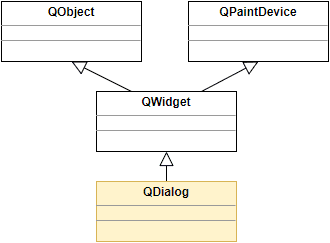

# 1. 对话框的概念
- 对话框是与用户进行简短交互的顶层窗口
- `QDialog`是Qt中所有对话框窗口的基类
- `QDialog`继承于`QWidget`是一种容器类型的组件
    

- `QDialog`的意义 (有了`QWidget`为什么还要有`QDialog`?)
    - `QDialog`作为一种专用的交互窗口而存在
    - `QDialog`不能作为子部件嵌入其它容器中
        > `QWidget`若有父组件，将作为一个可见的部件被嵌入到父组件中
    - `QDialog`是定制了窗口式样的特殊的QWidget

# 2. 编程实验 QDialog 和 QWidget 的区别
实验目录：[Test](vx_attachments\017_Dialogs_and_their_types\Test)
代码：main.cpp, 实验一

# 3. 对话框的类型
## 3.1. 类型
- 模态对话框(`QDialog::exec()`)
    - 显示后无法与父窗口进行交互
    - 是一种阻塞式的对话框调用方式
- 非模态对话框(`QDialog::show()`)
    - 显示后独立存在可以同时与父窗口进行交互
    - 是一种非阻塞式的对话框调用方式

## 3.2. 应用场合
- 一般情况下
    - 模态对话框用于必须依赖用户选择的场合(出场率：80%)
        - 消息提示，文件选择，打印设置，等
    - 非模态对话框用于特殊功能设置的场合(出场率：20%)
        - 查找操作，属性设置，等
- 小技巧
    - 在栈上创建模态对话框是最简单常用的方式
    - 一般情况下非模态对话框需要在堆上创建
    - 通过`QDialog::setModal`函数可以创建混合特性的对话框
        > 综合了非模态对话框和模态对话框的特性，在运行机理上是非模态对话框的特性，在表现形式上是模态对话框的特性。
    - 非模态对话框需要指定`Qt::WA_DeleteOnClose`属性
        > 关闭对话框的时候，同时删除对话框对象

# 4. 编程实验不同特性的对话框
实验目录：[Test](vx_attachments\017_Dialogs_and_their_types\Test)
代码：main.cpp, 实验二

# 5. 对话框的返值
- 只有模态对话框才有返回值的概念
    > 因模态对话框是需要用户进行选择的
- 模态对话框的返回值用于表示交互结果
- `QDialog::exec()`的返回值为交互结果
    - `void QDialog::done(int i)`关闭对话框并将参数作为交互结果
    - `QDialog::Accepted` - 用户操作成功
    - `QDialog::Rejected` - 用户操作失败

# 6. 编程实验对话框的返回值
实验目录：[Test](vx_attachments\017_Dialogs_and_their_types\Test)
代码：main.cpp, 实验三

# 7. 小结
- 对话框分为模态对话框和非模态对话框
- 模态对话框是阻塞式的
- 模态对话框用于依赖用户交互结果的场合
- 非模态对话框是非阻塞式的
- 非模态对话框用于功能设置的场合
