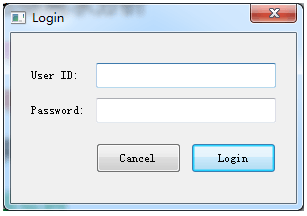
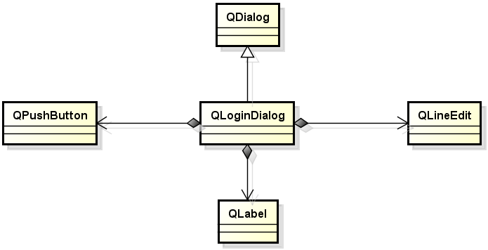
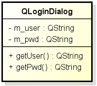

# 1. 018_登录对话框实例分析
- 登陆对话框是应用程序中的常用部件
    思考:
    如何开发一个可以在不同项目间复用的登陆对话框?

- 登陆对话框的核心需求
    - 可复用软件部分
    - 获取用户名和密码
    - 附加需求 : 随机验证码

    

- 登陆对话框的设计与架构
    

# 2. 实例分析
工程目录：[login](vx_attachments\018_Login_dialog_instance_analysis\login)
`setFixedSize(285, 170); /* 对话框的大小不可变 */`
`PwdEdit.setEchoMode(QLineEdit::Password); /* 设置编辑框密码显示为*号 */`

- 设计要点 : 如何获取用户输入的用户名和密码?
    扩展为通用问题 : 如何在两个不同的对话框间传递数据?
    解决方案:(开接口)
    
    通过附加的成员变量和成员函数,
    完成不同对话框将的数据传递!

- 尚待完善的地方:
    1. 检查用户名和密码是否为空
        - 当用户名或密码为空时提示错误
    2. 随机验证码
        - 当验证码输入错误时进行提示
        - 验证码随机刷新

# 3. 小结
- 登陆对话框作为可复用的软件部分进行开发
- 对话框之间通过成员变量和成员函数传递数据
    - 将用户数据保存在私有成员变量中
    - 通过公有成员函数进行数据传递

