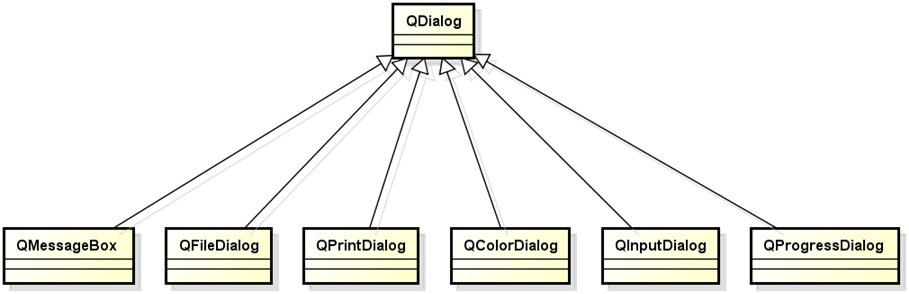

# 1. 标准对话框总览
- Qt 为开发者提供了一些<font color=red>可复用的</font>对话框类型
- Qt 提供的可复用对话框<font color=red>全部继承自<font color=blue>QDialog</font>类</font>
    
- Qt中的标准对话框<font color=red>遵循相同的使用方式</font>

    ```cpp
    /* 定义对话框对象 */
    DialogType dlg(this);
    /* 设置对话框属性 */
    dlg.setPropertyXXX(value);

    if (dlg.exec() == DialogType::Value) { /* 模态 */
        /* 获取对话框数据 */
        Type v = dlg.getDialogValue();
        /* 处理对话框数据 */
        // ...
    }
    ```

# 2. 消息对话框
- <font color=red>消息对话框</font>是应用程序中<font color=red>最常见的</font>界面元素
- 消息对话框主要用于:
    - 为用户<font color=red>提示重要信息</font>
    - 强制用户进行操作选择

    

- 消息对话框的使用方式

    ```cpp
    /* 构造消息对话框对象 */
    QMessageBox msg(this);
    /* 设置消息对话框的相关属性 */
    msg.setWindowTitle("Message Title");
    msg.setText("This is message content!");
    msg.setIcon(QMessageBox::Information);
    msg.setStandardButtons(QMessageBox::Ok | QMessageBox::Cancel);

    if (msg.exec() == QMessageBox::Ok) {
        qDebug() <<　＂Ok button is clicked!＂;
    }
    ```

- QMessageBox 中的实用函数 (简化写法)
    - QMessageBox::question
    - QMessageBox::information
    - QMessageBox::warning
    - QMessageBox::critical
    - QMessageBox::about
    > 帮助中查找 QMessageBox, 查看类中的成员函数
# 3. 文件对话框
- 文件对话框常用于以下情形
    - Open Mode
        - 应用程序<font color=red>需要用户打开一个外部的文件</font>
    - Save Mode
        - 应用程序中<font color=red>需要将当前内容存储于用户指定的外部文件中</font>

- 文件对话框的使用方式

    ```cpp
    QFileDialog fd(this);
    /* save mode : QFileDialog::AcceptSave 保存模式 */
    fd.setAcceptMode(QFileDialog::AcceptOpen); /* 打开模式 */
    /* multi-selection : QFileDialog::ExistingFiles 一次打开多个文档 */
    fd.setFileMode(QFileDialog::ExistingFile); /* 一次打开单个文档 */

    if (fd.exec() == QFileDialog::Accepted) {
        QStringList fs = fd.selectedFiles();
        /* process variable fs */
    }
    ```
- 文件类型<font color=red>过滤器</font>
    - 在文件对话框中可以<font color=red>通过文件后缀定义过滤器</font>
    - 过滤器定义规则:
        `显示名(*.后缀1 *.后缀2 ... *.后缀N)`
        > - 例:
        >     - `"Image(*.png *.xpm *.jpg)"`
        >     - `"Text(*.txt)"`
        >     - `"All(*.*)"`
        > - 添加多个过滤器用两个分号 `;;` 隔开
        >     - `dlg.setFilter("Image(*.png *.xpm *.jpg);;Text(*.txt);;All(*.*)");`

- QFileDialog 中的实用函数 (简化写法)
    - QFileDialog::getOpenFileName
    - QFileDialog::getOpenFileNames
    - QFileDialog::getSaveFileName
    > 帮助中查找 QFileDialog, 查看类中的成员函数
# 4. 小结
- Qt 中提供了多个<font color=red>可复用的</font>对话框类型
    - 继承于<font color=red>QDialog</font>类型
    - 遵循<font color=red>相同的</font>使用方式
- <font color=red>QMessageBox</font> 用于提示重要的程序信息
- <font color=red>QFileDialog</font> 用于获取系统中的文件路径