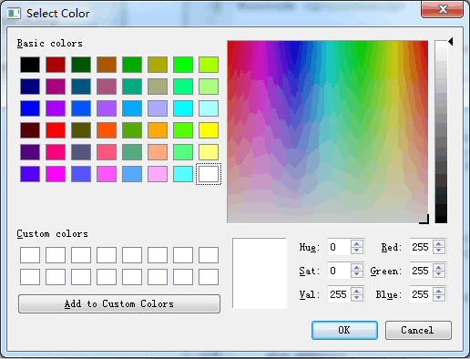
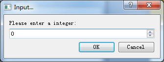

# 1. 颜色对话框
- Qt 中提供了预定义的颜色对话框QColorDialog类
- QColorDialog类用于提供指定颜色的对话框部件


- 颜色对话框的使用方式
    ```cpp
    /* 构造颜色对话框对象 */
    QColorDialog dlg(this);
    /* 设置颜色对话框的相关属性 */
    dlg.setWindowTitle("Color Editor");
    dlg.setCurrentColor(Qt::red); /* 初始颜色 */
    if (dlg.exec() == QColorDialog::Accepted) {
        qDebug() << dlg.selectedColor();
    }
    ```
- QColor
    - Qt中的<font color=red>QColor</font>类用来在程序中表示颜色的概念
    - <font color=red>QColor</font>类同时支持<font color=red>多种颜色表示方式</font>
        - RGB : 以红, 绿, 蓝为基准的三色模型
        - HSV : 以色调, 饱和度, 明度为基准的六角椎体模型
        - CMYK : 以天蓝, 品红, 黄色, 黑为基准的全彩印刷色彩模型

- QColorDialog 中的实用函数
    - QColorDialog::getColor

# 2. 输入对话框
- Qt中提供了预定义的输入对话框QInputDialog类
- QInputDialog类用于需要临时进行数据输入的场合


- 输入对话框的实用方式
    ```cpp
    /* 构造输入对话框对象 */
    QInputDialog dlg(this);
    /* 设置输入对话框的相关属性 */
    dlg.setWindowTitle("Input Test");
    dlg.setLabelText("Please input an integer:");
    // dlg.setInputMode(QInputDialog::TextInput); /* 数入文本 */
    dlg.setInputMode(QInputDialog::IntInput);     /* 输入整数 */
    if (dlg.exec() == QInputDialog::Accepted) {
        // qDebug() << dlg.textValue();
        qDebug() << dlg.intValue();
    }
    ```
- 输入对话框的输入模式
    - QInputDialog::TextInput - 输入文本字符串
    - QInputDialog::IntInput - 输入整型数
    - QInputDialog::DoubleInput - 输入浮点数

- QInputDialog 中的实用函数
    - QInputDialog::getDouble
    - QInputDialog::getInt
    - QInputDialog::getItem - 下拉选项
    - QInputDialog::getText

# 3. 小结
- <font color=red>QColorDialog</font> 类用于提供指定颜色的对话框部件
- <font color=red>QColor</font> 类用来在程序中表示颜色的概念
- <font color=red>QInputDialog</font> 类用于需要临时进行数据输入的场合
