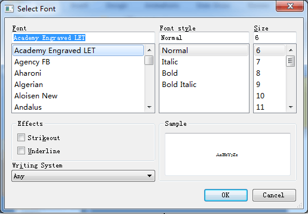
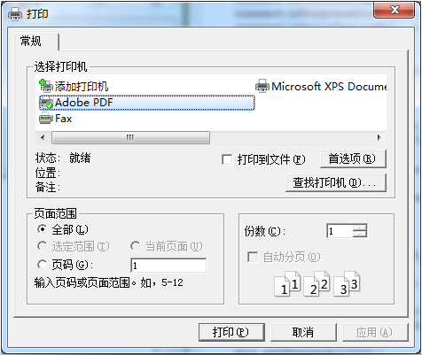
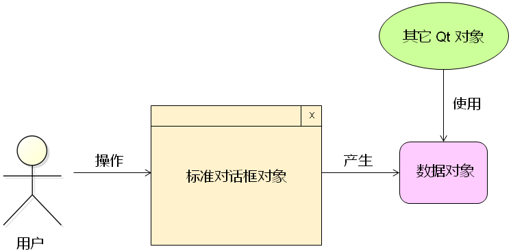

# 1. 字体对话框
- Qt章提供了预定义的字体对话框QFontDialog类
- QFontDialog类用于提供选择字体的对话框部件

- 字体对话框的使用方式
    ```cpp
    // 构造字体对话框对象
    QFontDialog dlg(this);
    // 设置字体对话框的相关属性
    dlg.setWindowTitle("Font Dialog Test");
    dlg.setCurrentFont(QFont("Courier New", 10, QFont::Bold)); // 初始字体

    if( dlg.exec() == QFontDialog::Accepted )
    {
        qDebug() << dlg.selectedFont();
    }
    ```
- QFontDialog 中的实用函数
    - QFontDialog::getFont

# 2. 进度对话框
- Qt中提供了预定义的进度对话框QProgressDialog类
- QProgressDialog类用于显示进度信息
- QProgressDialog类用于需要用户等待的场合


- 进度对话框的使用方式
    ```cpp
    // 构造进度对话框对象
    QProgressDialog dlg(this);
    // 设置进度对话框的相关属性
    dlg.setWindowTitle("Updating...");
    dlg.setLabelText("Downloading update from server...");
    dlg.setMinimum(0);    // 设置最小进度值
    dlg.setMaximum(100);  // 设置最大进度值
    dlg.setValue(35);

    // create a new thread

    dlg.exec();
    ```

# 3. 打印对话框
- Qt中提供了预定义的打印对话框QPrintDialog类
- QPrintDialog 类用于设置打印相关的参数信息


- 打印对话框的使用方式
    ```cpp
    // 构造打印对话框对象
    QPrintDialog dlg(this);
    // 设置打印对话框的相关属性
    dlg.setWindowTitle("Print Dialog Test");

    if( dlg.exec() == QPrintDialog::Accepted )
    {
        QPrinter* p = dlg.printer();

        // use printer object to print data
        QTextDocument td;

        //td.setPlainText("Printer object test!");
        td.setHtml("<h1>Print html object test</hl>"); // h1在html中表示字体大写

        //p->setOutputFileName("D:\\test.xps");
        p->setOutputFileName("D:\\test.pdf");

        td.print(p);
    }
    ```
- QPrinter
    - Qt 中的QPrinter类是打印设备及其参数的封装
    - QPrinter 类封装了系统中打印设备的驱动接口
    - QPrinter 以相同方式使用系统中的不同打印设备

# 4. 小结
- Qt中标准对话框的**设计模式**(使用方法)
    - <font color=red>GUI界面</font>部件产生<font color=blue>数据对象</font>
    - <font color=green>业务逻辑</font>中的其他对象使用<font color=blue>数据对象</font>
    - <font color=red>GUI界面</font>与<font color=green>业务逻辑</font>通过<font color=blue>数据对象</font>连接

