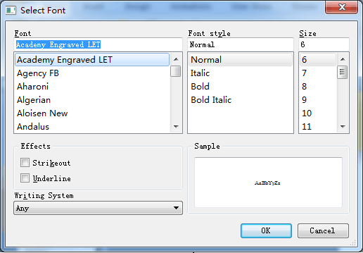
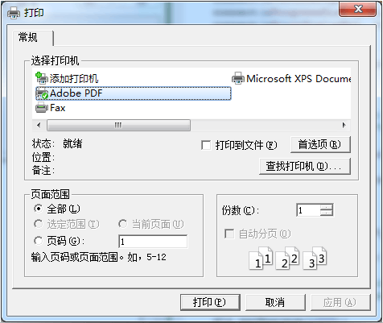
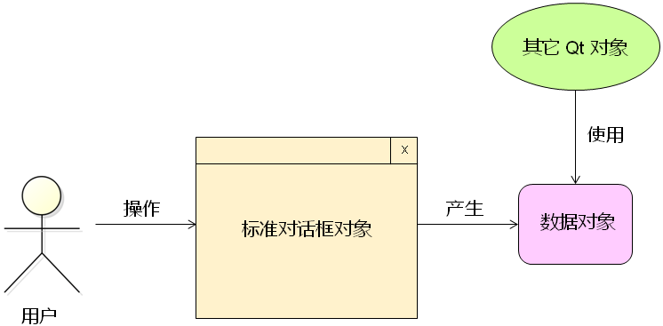

# 1. 字体对话框
- Qt中提供了<font color=red>预定义的</font>字体对话框`QFontDialog`类
- `QFontDialog`类用于提供<font color=red>选择字体的对话框部件</font>

- 字体对话框的使用方式
    ```cpp
    /* 构造字体对话框对象 */
    QFontDialog dlg(this);
    /* 设置字体对话框的相关属性 */
    dlg.setWindowTitle("Font Dialog Test");
    dlg.setCurrentFont(QFont("Courier New", 10, QFont::Bold)); /* 初始字体 */
    if (dlg.exec() == QFontDialog::Accepted) {
        qDebug() << dlg.selectedFont();
    }
    ```
    > 打印方式：`QFont( "Arial,10,-1,5,75,0,0,0,0,0" )`

- `QFontDialog` 中的实用函数（简化写法）
    - `QFontDialog::getFont`

# 2. 进度对话框
- Qt中提供了<font color=red>预定义的</font>进度对话框`QProgressDialog`类
- `QProgressDialog`类用于<font color=red>显示进度信息</font>
- `QProgressDialog`类用于<font color=red>需要用户等待的场合</font>


- 进度对话框的使用方式
    ```cpp
    /* 构造进度对话框对象 */
    QProgressDialog dlg(this);
    /* 设置进度对话框的相关属性 */
    dlg.setWindowTitle("Updating...");
    dlg.setLabelText("Downloading update from server...");
    dlg.setMinimum(0);    /* 设置最小进度值 */
    dlg.setMaximum(100);  /* 设置最大进度值 */
    dlg.setValue(35);

    /* create a new thread */

    dlg.exec();
    ```

# 3. 打印对话框
- Qt中提供了<font color=red>预定义的</font>打印对话框`QPrintDialog`类
- `QPrintDialog` 类用于<font color=red>设置打印相关的参数信息</font>


- 打印对话框的使用方式
    ```cpp
    /* 构造打印对话框对象 */
    QPrintDialog dlg(this);
    /* 设置打印对话框的相关属性 */
    dlg.setWindowTitle("Print Dialog Test");
    if (dlg.exec() == QPrintDialog::Accepted) {
        QPrinter* p = dlg.printer();
        /* use printer object to print data */
        QTextDocument td;
        //td.setPlainText("Printer object test!");
        td.setHtml("<h1>Print html object test</hl>"); /* h1在html中表示字体大写 */
        //p->setOutputFileName("D:\\test.xps");
        p->setOutputFileName("D:\\test.pdf");
        td.print(p);
    }
    ```
- `QPrinter`
    - Qt 中的`QPrinter`类是<font color=red>打印设备及其参数的封装</font>
    - `QPrinter` 类<font color=red>封装</font>了系统中<font color=red>打印设备的驱动接口</font>
    - `QPrinter` 以<font color=red>相同方式</font>使用系统中的不同打印设备

# 4. 小结
- Qt中标准对话框的**设计模式**(使用方法:下图)
    - <font color=red>GUI界面</font>部件产生<font color=red>数据对象</font>
    - <font color=red>业务逻辑</font>中的其他对象使用<font color=red>数据对象</font>
    - <font color=red>GUI界面</font>与<font color=red>业务逻辑</font>通过<font color=red>数据对象</font>连接

