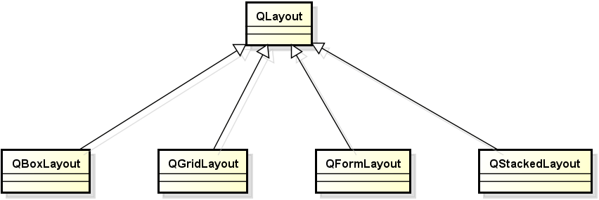
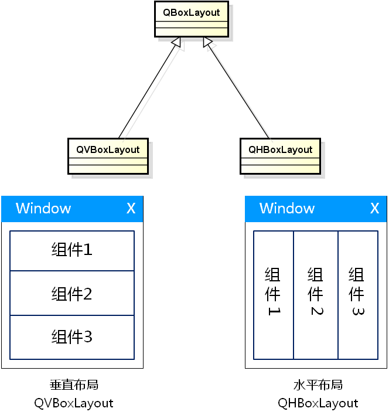
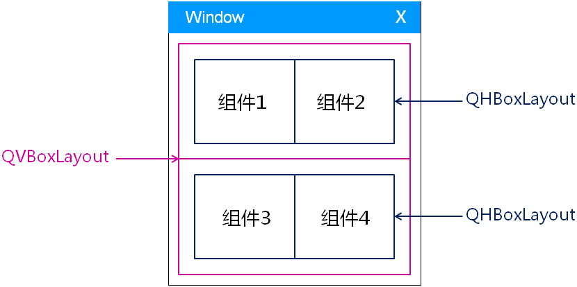

# 1. 存在的问题
- 目前的GUI开发方式 : 绝对定位
    - 直接在像素级指定各个组件的位置和大小
        - `void QWidget::move(int x, int y)`
        - `void QWidget::resize(int w, int h)`
- 问题
    - 组件的位置和大小无法自适应父窗口的变化

# 2. 实验 - 存在的问题
实验目录：[test](vx_attachments\022_Layout_manager_1\test)
代码：实验一

# 3. 布局管理器
- 解决方案 : 布局管理器
    - 提供相关的类对界面组件进行布局管理
        - 能够自动排列窗口中的界面组件
        - 窗口变化后自动更新界面组件的大小

- 布局管理器介绍
    - `QLayout` 是 Qt 中布局管理器的抽象基类
    - 通过继承 `QLayout` 实现了功能各异且互补的布局管理器（非抽象基类）
    - Qt 中可以根据需要自定义布局管理器
    - 布局管理器不是界面部件, 而是界面部件的定位策略

> 有兴趣可实现自定义布局管理器

# 4. `QBoxLayout` 布局管理器
- `QBoxLayout` 布局管理器
    - 以水平或者垂直的方式管理界面组件

# 5. 实验 - QBoxLayout
实验目录：[test](vx_attachments\022_Layout_manager_1\test)
代码：实验二

- 替换绝对定位方式
    - `QSizePolicy` (默认大小策略是，layout中宽度跟着变化，高度不变)
    - 帮助文档 : 搜索 `QWidget` -> `QSizePolicy sizePolicy () const`

- 设置布局管理器间隔
    - `layout->setSpacing(30);`

# 6. 布局管理器的嵌套
- 布局管理器可以相互嵌套, 形成更加复杂的布局方式
    - 布局嵌套几乎可以完成所有常用的界面布局
    - 自定义布局类可以达到个性化界面布局的效果
        > 自己编写一个布局管理器是个比较麻烦的事情，我们能用现成的就用现成的。
- QBoxLayout 嵌套实例
    

# 7. 实验 - 布局嵌套实例
实验目录：[test](vx_attachments\022_Layout_manager_1\test)
代码：实验三

# 8. 小结
- 绝对定位的布局方式无法自适应窗口的变化
- Qt 提供了相关的类对界面组件进行布局管理
- Qt 预定义了功能各异且互补的布局管理器
- 布局管理器能够相互嵌套形成复杂的布局

课后作业 :
改写计算器工程界面代码,使用layout