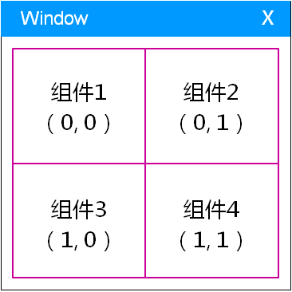
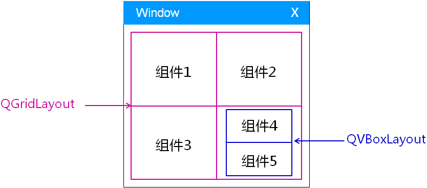

# 1. QBoxLayou比例系数
## 1.1. 使用方法
- 布局管理器中的比例系数
    - 默认情况下以等比例的方式更新组件的大小
    - 可以自定义组件大小更新时的比例系数

- `QBoxLayout`中的比例系数设置 (`QBoxLayout`的成员函数)
    - `void setStretch(int index, int stretch)`
        > index：格子下标；stretch：比例系数
    - `bool setStretchFactor(QWidget *widget, int stretch)`
        > 若`widget`组件并不存在`QBoxLayout`中时，返回false
    - `bool setStretchFactor(QLayout *layout, int stretch)`
        > 设置被嵌套的布局管理器的比例系数

## 1.2. 实验 - 比例系数
实验目录：[23-1](vx_attachments\023_Layout_manager_2\23-1)
> 组件的初始大小是独立于布局管理器设置的（组件有默认的最小大小），因此不能保证组件的大小始终符合比例系数的设置!

# 2. QGridLayout布局管理器
- `QGridLayout`布局管理器
    - 以网格（二维）的方式管理界面组件

    

- `QGridLayout`中的比例系数设置
    - `void setColumnStretch(int column, int stretch)`
    - `void setRowStretch(int row, int stretch)`

# 3. 实验 - QGridLayout
实验目录：[23-2](vx_attachments\023_Layout_manager_2\23-2)
> 子窗口占用多行或多列时规律 : 鼠标改动窗口大小时, 只会扩展占用行数或列数最小的窗口(widget)

# 4. QGridLayout布局管理器的嵌套
- `QGridLayout`支持嵌套其它布局管理器成为其管理对象

# 5. 小结
- `QGridLayout` 以网格的方式对组件进行管理
- `QGridLayout` 中的组件可以根据需要跨越多个网格
- `QBoxLayout` 和 `QGridLayout` 支持比例系数的概念
- 比例系数决定了组件大小的相对变化

课后作业 :
上面图中QGridLayout布局管理器的嵌套实现