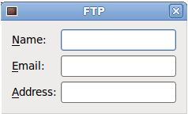
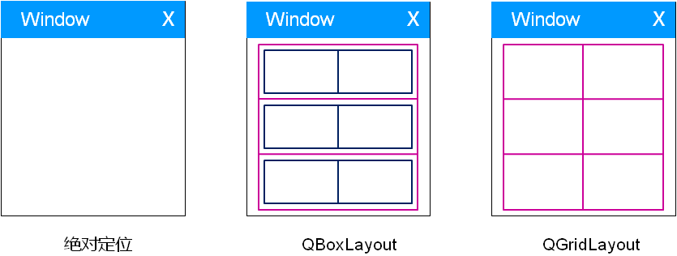
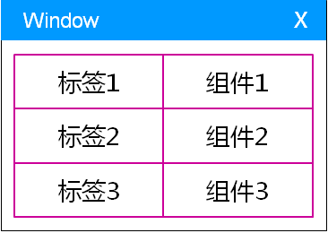
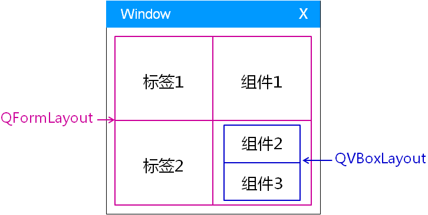

- 思考
    如何设i十下面的图形用户界面？
    

- 解决方案
    - <font color=#d00>绝对定位</font>组件的坐标和大小
    - 嵌套 <font color=#d0d>QBoxLayout</font>
    - 创建 3x2 的 <font color=#00d>QGridLayout</font>

    

# 1. [<u>实验 - QGridLayout 的实现示例</u>](code/024_Layout_manager_3)

# 2. QFormLayout
- <font color=#00d>QFormLayout</font>布局管理器
    - 以<font color=#d00>表单 (Form) </font>的方式管理界面组件
    - <font color=#00d>表单布局</font>中的<font color=#00d>标签</font>和<font color=#00d>组件</font>是<font color=#d00>相互对应</font>的关系

    

- <font color=#d0d>QFormLayout</font>的用法概要
```cpp
void addRow(QWidget* label, QWidget* field)
void addRow(QWidget* label, QLayout* field)
void addRow(const QString& labelText, QWidget* field)
void addRow(const QString& labelText, QLayout* field)
```
> 表单布局<font color=#d0d>支持嵌套</font>，其它布局管理器<font color=#00d>可以作为子布局被其管理</font>。

- QFormLayout的样式函数(查看帮助文档)
```c
void setRowWrapPolicy(RowWrapPolicy policy)
void setLabelAlignment(Qt::Alignment alignment)
```

# 3. [<u>实验 - QFormLayout 的实现示例</u>](code/024_Layout_manager_3)

- 布局管理器的嵌套
    

# 4. 小结
- <font color=#00d>QFormLayout</font>以<font color=#d0d>表单</font>的方式管理界面组件
- <font color=#00d>QFormLayout</font>的<font color=#d00>样式</font>设置<font color=#d00>简洁</font>明了
- <font color=#00d>QFormLayout</font>支持布局管理器的<font color=#00d>相互嵌套</font>
- <font color=#00d>QFormLayout</font>是嵌入式产品中<font color=#d0d>最常用的布局方式</font>

作业: QFormLayout布局管理器的嵌套