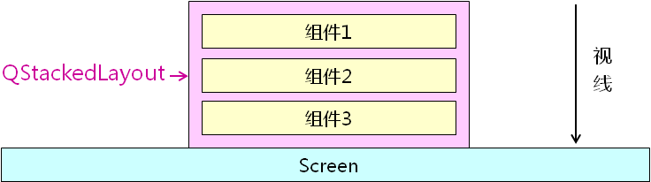

# 1. 最特别的布局管理器
- 栈式布局管理器（<font color=#00d>QStackedLayout</font> )
    - 所有组件在<font color=#d00>垂直于屏幕</font>的方向上被管理
    - 每次<font color=#00d>只有一个组件</font>会显示在屏幕上
    - 只有<font color=#d0d>最顶层的组件</font>会被最终显示

    

- 栈式布局管理器的特点
    - <font color=#d00>组件大小一致</font>且充满父组件的显示区
    - <font color=#d0d>不能直接嵌套</font>其它布局管理器
    - 能够<font color=#00d>自甶切换</font>需要显示的组件
    - 每次能且仅能<font color=#d0d>显示一个组件</font>

- QStackedLayout的用法概要
```c
int addWidget(QWidget*widget)
QWidget* currentWidget()
void setCurrentIndex(int index)
int currentlndex()
```
# 2. 实验 - 栈式布局初探
实验目录：[25-1](vx_attachments\025_Layout_manager_4\25-1)

# 3. 计时器
- 计时器的概念 - QTimer
    - 计时器是<font color=#00d>工程开发中</font>非常重要的角色
    - 计时器用于<font color=#d00>每隔一定的时间触发一个消息</font>
    - 计时器<font color=#d0d>消息</font>最终会被转化为<font color=#d0d>函数调用</font>
    - 宏观上
        - <font color=green>计时器在每个时间间隔会阔用指定的函数</font>

- Qt中的计时器
    - 计时器 (<font color=#00d>QTimer</font>) 的使用方法
        1. 编写计时器消息处理函数
        2. 在程序中创建计时器对象
        3. 连接计时器消息和消息处理函数(信号与槽)
        4. 设置计时器时间间隔并启动计时

# 4. 实验 - 计时器的使用
实验目录：[25-1](vx_attachments\025_Layout_manager_4\25-1)

# 5. 小结
- <font color=#00d>QStackedLayout</font>以栈的方式管理界面组件
- <font color=#00d>QStackedLayout</font>中的组件<font color=#d0d>最多只有一个显示</font>
- <font color=#00d>QStackedLayout</font>可以<font color=#d0d>自甶切换</font>需要显示的组件
- <font color=#d00>QTimer</font>是Qt中的计时器组件
- <font color=#d00>QTimer</font>能够<font color=#d0d>在指定的时间间隔</font>触发消息

栈式布局管理器用途:
    1. 安装软件时, 上一步/下一步 的界面
    2. 嵌入式设备中 左划右划 的界面
