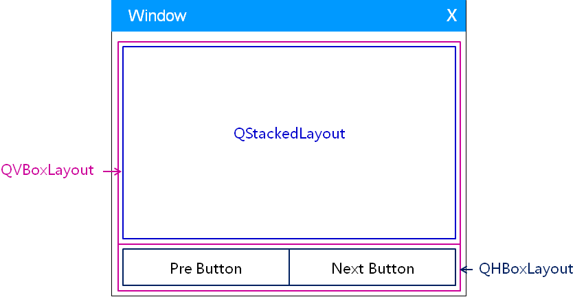
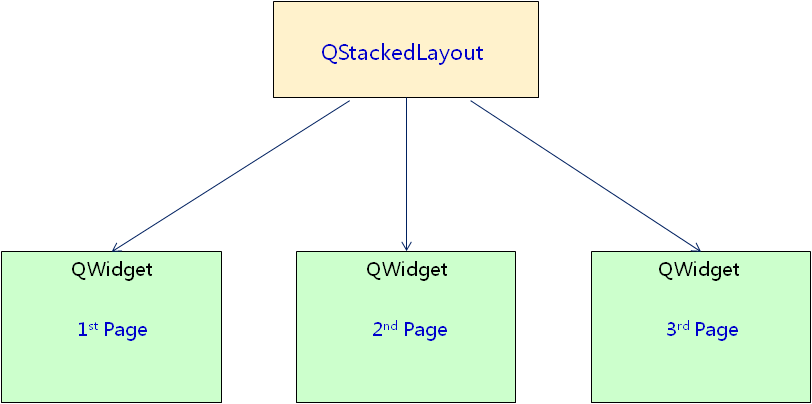
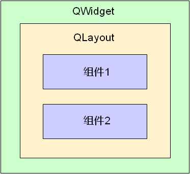
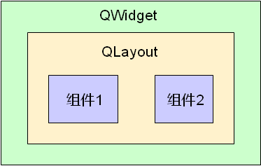

# 1. 需求分析
- 练习开发一个向导用户界面
    - 在同一个界面上展现不同的向导页面
    - 通过"上一步"和"下一步"按钮进行切换
    - 不同页面上的元素组件和组件扫陆都不相同
    - 页面中的组件通过布局管理器进行排布

# 2. 解决方案
- 通过布局嵌套进行界面设计
    

- 通过QStackedLayout管理不同的页面
    

- 通过子组件的方式生成不同的页面
    

# 3. 实验 - 向导用户界面

- 注意事项
    - 任意容器类的组件都可以指定布局管理器
    - 同一个布局管理器中的组件拥有相同的父组件
    - 设置布局管理的同时隐式的指定了父子关系

    
    > 图中组件1和组件2被同一个布局管理器管理，拥有相同的父组件。

# 4. 小结
- 布局管理器可以相互嵌套构成复杂用户界面
- 任意容器组件均可设置布局管理器
- 同一个布局管理器中的组件拥有相同父组件
- 组件间的父子关系是Qt中内存管理的重要方式