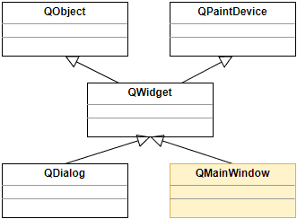
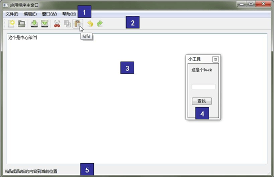
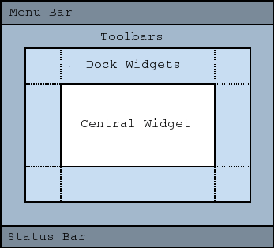
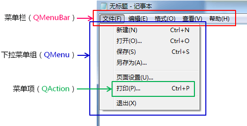

# 1. 主窗口的概念

- 应用程序中的主窗口
    - 主窗口是与用户<font color=red>进行长时间交互的顶层窗口</font>
    - 程序的<font color=red>绝大多数功能</font>直接由主窗口提供
    - 主窗口通常是<font color=red>应用程序启动后显示的第一个窗口</font>
    - 整个程序由<font color=red>一个主窗口</font>和<font color=red>多个对话框</font>组成

- Qt中的主窗口
    - Qt开发平台中aj妾支持主窗口的概念
    - QMainWindow是Qt中主窗口的基类
    - QMainWindow继承于<font color=red>QWidget</font>是一种<font color=red>容器类型</font>(非数据结构中的容器)的组件

    

- QMainWindow中封装的秘密
    1-菜单栏 2-工具栏 3-中心组件 4-停靠组件 5-状态栏
    

- QMainWindow中的组件布局 (自带的布局管理功能)
    
    > QMainWindow也是一个容器类型的组件, 并且是一个顶层的组件, 只能以窗口的形式存在, 不能作为其他组件的子组件

# 2. 主窗口中的菜单


- 在Qt主窗口中创建菜单
    ```c
    QMenuBar *mb = menuBar(); // member function
    QMenu *menu = new QMenu ("File (&F)") ;
    QAction *action = new QAction ("New", NULL);

    menu->addAction(action);

    mb->addMenu(menu);
    ```

# 3. 实验 - 主窗口中创建菜单
实验目录：[NotePad](vx_attachments\027_mianwindow_in_app\NotePad)

(复习二阶构造)

- 小技巧
    - 快捷键设置
        `action->setShortcut(QKeySequence(KEY))`
        - `QKeySequence` - Qt中与快捷键相关的类
        - `KEY` - Qt中代表键值的常量

# 4. 小结
- 主窗口是与用户<font color=red>进行长时间交互的顶层窗口</font>
- 主窗口通常是<font color=red>应用程序启动后显示的第一个窗口</font>
- <font color=red>QMainWindow</font> 是Qt中主窗口的基类
- <font color=red>QMainWindow</font> 是一种<font color=red>容器类型</font>的窗口组件
- <font color=red>QMainWindow</font> 中封装了菜单栏，工具栏，状态栏等组件