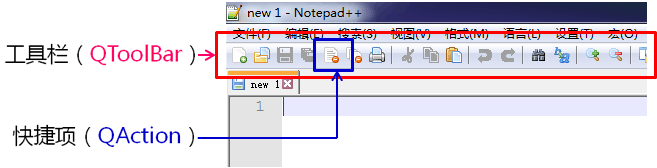
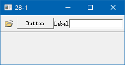
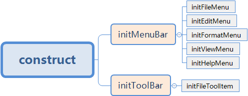

# 1. 主窗口中的工具栏

- <font color=red>工具栏</font>的概念和意义
    - 应用程序中<font color=red>集成各种功能</font>实现快捷使用的一个区域
    - 工具栏并<font color=red>不是</font>应用程序中<font color=red>必须</font>存在的组件
    - 工具栏中的元素<font color=red>可以是各种窗口组件</font>
    - 工具栏中的元素<font color=red>通常以图标按钮的方式存在</font>

- 在Qt中提供与工具栏相关的类组件
    

- 在Qt主窗口中创建工具栏
    ```cpp
    /* call memeber function */
    QToolBar *tb = addToolBar("Tool Bar");
    /* create item for Tool Bar */
    QAction *action = new QAction("", NULL);

    /* set action property */
    action->setToolTip("Open"); /* 鼠标停留在标签上显示的名称 */
    action->setIcon(QIcon(":/Res/pic/open.png")); /* 设置图标 */

    /* add item to Tool Bar */
    tb->addAction(action);
    ```

- `QToolBar`的关键成员函数
    - `void setFloatable(bool floatable)` /* 当前创建的工具栏能否悬浮 */
    - `void setMovable(bool movable)` /* 工具栏能否停留吸附在上下左右的边上 */
    - `void setIconSize(const QSize &iconSize)` /* 设置图标按钮大小 */

# 2. 实验 - 工具栏可包含的内容
实验目录：[28-1](vx_attachments\028_Toolbar_in_the_mainwindow\28-1)


- `QToolBar`中可以加入任意的`QWidget`组件
    ```c
    QToolBar *tb = addToolBar("Tool Bar");

    QPushButton *b = new QPushButton("Button");
    QLabel *l = new QLabel("Label");
    QLineEdit *e = new QLineEdit();

    tb->addWidget(b);
    tb->addWidget(l);
    tb->addWidget(e);
    ```
- Qt 中添加资源文件
    - 右键项目名 -> 添加新文件... -> Qt -> Qt资源文件 -> 名称:Res, 路径:当前项目目录 -> 下一步 -> 完成
    - 拷贝 open.png 到项目当前目录
    - 双击资源/Res.qrc -> 添加 -> 添加前缀 : /Res (资源文件里虚拟的文件路径) -> 添加 -> 添加文件:open.png
    - 使用 :
        - `QIcon(":/Res/open.png")`
        - ":" 冒号告诉Qt平台我们要设置的图标在资源文件里
        - 利用QIcon构造函数生成一个QIcon对象


# 3. 实验 - 工具栏实战
实验目录：[NotePad](vx_attachments\028_Toolbar_in_the_mainwindow\NotePad)

- 快捷键区别
    - `makeAction(action, "New(N)", Qt::CTRL + Qt::Key_N)`
    - `makeAction(action, "New(&N)", Qt::CTRL + Qt::Key_N)`
        > 多一个 '&' 表示单击菜单栏后, 按相应的按键可打开相应的功能

- 代码结构（框架）
    


# 4. 小结
- 工具栏是<font color=red>集成各种功能</font>的一个快捷区域
- Qt中通过 `QToolBar` 进行工具栏的创建
- `QToolBar` 能够加入任意的 `QWidget` 组件
- `QToolBar` 中的元素通常以<font color=red>图标按钮</font>的方式存在
