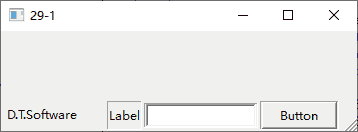
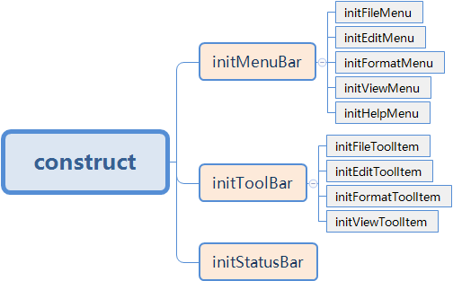

- 完善工具栏
    

# 1. 主窗口中的状态栏
- 状态栏的概念和意义
    - 状态栏是应用程序中<font color=red>输出简要信息的区域</font>
    - 状态栏<font color=red>位于主窗口的最底部</font>
    - 状态栏中的消息类型
        - <font color=red>实时消息</font>，如：当前程序状态
        - <font color=red>永久消息</font>，如：程序版本号，机构名称
        - <font color=red>进度消息</font>，如：进度条提示，百分比提示

- 在Qt中提供与<font color=red>状态栏</font>相关的类组件
    
    > QStatusBar 本就是一个容器类型的类, 可以在这个类对应的对象中放置<font color=red>任意类型</font>的QT组件

- 在Qt主窗口中创建状态栏
    ```c
    /* call member function */
    QStatusBar *sb = statusBar();
    /* create widget for Status Bar */
    QLabel *l = new QLabel("Label");
    QLineEdit *e = new QLineEdit();
    /* add widget to Status Bar */
    sb->addPermanentWidget(l);
    sb->addPermanentWidget(e);
    /* output message to Status Bar */
    sb->showMessage("D.T.Software"); /* 左对齐显示 */
    ```

- Qt状态栏(内置)的设计原则
    - <font color=red>左边的区域</font>用于输出<font color=red>实时消息</font>
	    - `addWidget` 在状态栏<font color=red>左半部分</font>添加组件
    - <font color=red>右边的区域</font>用于设置<font color=red>永久消息</font>
	    - `addPermanentWidget` 在状态栏<font color=red>右半部份</font>添加组件

# 2. 实验 - 状态栏的初体验
实验目录：[29-1](vx_attachments\029_Statusbar_in_the_mainwindow\29-1)


# 3. 实验 - 工具栏实战
实验目录：[NotePad](vx_attachments\029_Statusbar_in_the_mainwindow\NotePad)

代码框架


# 4. 小结
- 状态栏是程序中<font color=red>输出简要信息的区域</font>
- `QStatusBar` 是Qt中创建<font color=red>状态栏</font>组件的类
- `QStatusBar` 中可以添加任意的QWidget
- `QStatusBar` 有自己<font color=red>内置的设计原则</font>
- `QStatusBar` 可以定制出<font color=red>各种形式</font>的状态栏
