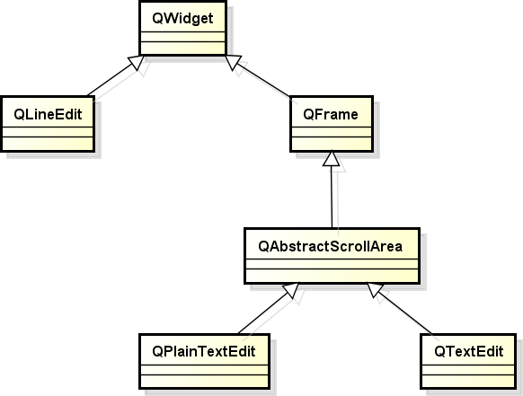
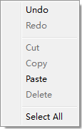
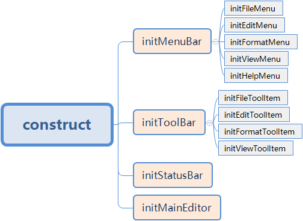

# 1. 文本编辑组件

- Qt中支持3种常用的文本编辑组件
    - QLineEdit
        - 单行文本编辑组件
    - QTextEdit
        - 多行富文本编辑组件
        > 相对普通文本,添加了多媒体的效果
    - QPIainTextEdit
        - 多行普通文本编辑组件

- Qt中常用文本编辑组件的继承层次图
    
    > 从继承关系可以看出, QTextEdit QPIainTextEdit 的功能比 QLineEdit 强大得多

- 不同文本组件的特性比较

    |                |         单行文本支持         |         多行文本支持         |        自定义格式支持         |          富文本支持          |
    | -------------- | --------------------------- | --------------------------- | --------------------------- | --------------------------- |
    | QLineEdit      | Yes | No   | No   | No   |
    | QPIainTextEdit | Yes | Yes | No   | No   |
    | QTextEdit      | Yes | Yes | Yes | Yes |
    > NotePad 项目为什么使用 QPIainTextEdit, 而不是用 QTextEdit ?
    > 只要实现用户需求就可以了, 不要过度设计, QTextEdit 适合开发像 word 那样的大型文字办公软件

- Qt中常用文本编辑组件的内置功能
    - 右键弹出式菜单
        
        > QT 与 java 里的 J2SE 横向对比 : 诞生的目标均是桌面应用程序的开发平台, J2SE里边也有文本编辑组件, 但是没有封装右键菜单的功能, 因此复制，粘贴，剪切，等功能都需要程序员自己完成. 因此就此功能而言 QT 更方便
    - 快捷键功能
        - 复制，粘贴，剪切，等

# 2. 实验 - 文本编辑组件的对比试验

# 3. 实验 - 文本编辑组件实战
代码框架

# 4. 小结
- Qt中提供了 3 种不同类型的文本编辑组件
- Qt中的文本编辑组件封装了常用的编辑功能
    - QLineEdit 用于 单行简单文本 输入的情形
    - QPIainTextEdit 用于多行简单文本输入的情形
    - QTextEdit 用于多行富文本输入的情形