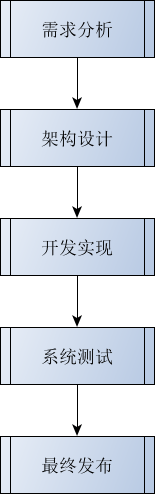
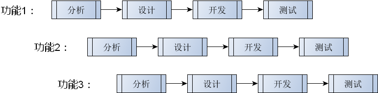
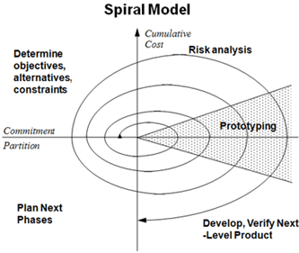
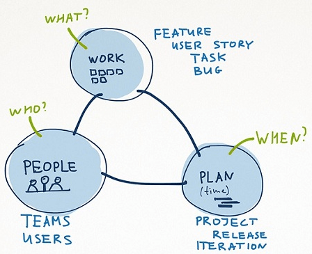
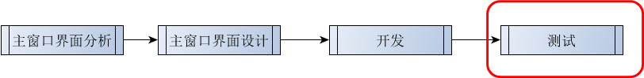

# 1. 软件开发流程 (同 : computer_fundamental:25_项目开发的前期设计)

- 什么是软件开发流程？
    - 通过一系列步骤保证软件产品的顺利完成
    - 软件产品在生命期内的管理方法学

- 软件开发流程的本质
    - 开发流程与具体技术无关
    - 开发流程是开发团队必须遵守的规则

- 常见软件开发流程
    - 即兴模型 (Build-and-Fix Model)
    - 瀑布模型 (Waterfall Model)
    - 增量模型  (Incremental Model)
    - 螺旋模型 (Spiral Model)
    - 敏捷模型 (Agile Modeling)

- 即兴模型（Build-and-Fix Model)
    - 与最终用户交流后立即开始进行开发
    - 没有需求分析和需求发掘的过程
    - 没有整体设计以及规划的过程
    - 没有相关软件文档，维护性差

- 瀑布模型 (Waterfall Model)
    - 通过自上而下的步骤进行软件开发
    - 每个开发步骤都是不可逆的

    
    > 适用 预研性项目

- 增量模型 （Incremental Model)
    - 将系统功能分解为互不重叠的子功能
    - 每次全力实现一个子功能
    - 子功能全部完成后系统开发结束

    
    > 待优化 : 如何更好地适配用户需求

- 螺旋模型 （Spiral Model)
    - 采用一种迭代的方法来进行系统开发
    - 软件项目分解成多个不同的版本完成
    - 每个版本的开发过程都需要用户参与
    - 根据前一个版本的反馈计划下一个版本

    
    > 适用用用类型的软件开发, 比如社交软件
    > 缺点 : 对于一些私人订制的软件有所缺陷, 与用户接触的时间都是进行下一个版本开发的时候

- 敏捷模型（Agile Modeling )
    - 一切从简
    - 拥抱变化
    - 高效工作
    - 持续开发

    

# 2. 项目中的开发流程
- 问题
    文本编辑器项目如何选择软件开发流程？

- 增量模型适合于文本编辑器的开发
    - 需求相对固定
    - 功能之间的耦合性弱

    第1阶段 :
    

# 3. 实验 项目阶段性测试
- 内存泄漏测试
    Linux下 : 分析 -> Valgrind 内存分析器 -> 等待程序运行起来 -> 关闭程序 -> 结果会显示在面板
    > beyond compare 对比bug改动
# 4. 小结
- 软件开发流程是开发团队遵守的一系列规则
- 软开发流程的意义在于保证产品的质量和进度
- 业界已经存在了多种开发流程的模型
- 每一种软件开发流程都有特定的适用范围
- 课程中容易采用增量模型进行项目开发
