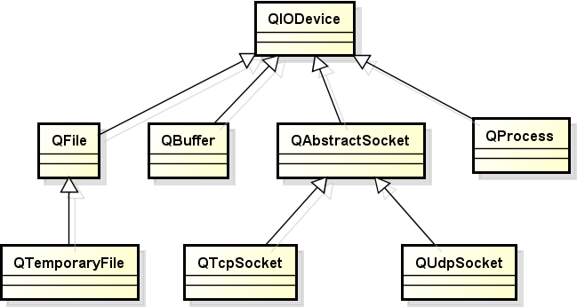
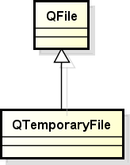

Qt中的IO操作

- Qt中IO操作的处理方式
    - Qt通过<font color=#d0d>统一的接口</font>简化了<font color=blue>文件</font>与<font color=blue>外部设备</font>的操作方式
    - <font color=#00d>Qt中的文件被看作一种特殊的外部设备</font>
    - Qt中的文件操作与外部设备的操作相同

    > 吸收了Linux中的概念, 一切皆文件

- IO操作中的关键函数接口
    - 打开设备: `bool open(OpenMode mode)`
    - 读取数据: `QByteArray read(qint64 maxSize)`
    - 写入数据: `qint64 write(const QByteArray &byteArray)`
    - 关闭设备: `void close()`

    > <font color=blue>IO操作的本质</font>: <font color=red>连续存储空间的数据读写</font>

- Qt中IO设备的类型
    - <font color=blue>顺序存取设备</font>
        - 只能<font color=#d0d>从头开始顺序的读写数据</font>，不能指定数据的读写位置
        > 比如连接在串口上的设备
    - <font color=red>随机存取设备</font>
        - <font color=#d0d>可以定位到任意的位置进行数据的读写</font> ( seek function )
        > 比如文件操作

- Qt中IO设备的继承层次图
    

# 1. Qt中的文件操作
- <font color=#d0d>QFile</font> 是 Qt 中用于文件操作的类
- <font color=#d0d>QFile</font> 对象对应到<font color=#d0d>计算机上的一个文件</font>

    ```cpp
    QFile file("C:/Users/hp/Desktop/test.txt");

    if( file.open(QIODevice::WriteOnly | QIODevice::Text) ) {
        file.write("D.T.Software");
        file.close();
    }

    if( file.open(QIODevice::Readonly | QIODevice::Text) ) {
        QByteArray ba = file.readAll();
        QString s(ba);

        qDebug() << s;

        file.close();
    }
    ```
- QFilelnfo类用于读取文件属性信息

    ```c
    QFile file ("C:/Users/hp/Desktop/test.txt");
    QFileInfo info(file);

    qDebug() << info.exists();        // 文件是否存在
    qDebug() << info.isFile();        // 是文件还是文件夹
    qDebug() << info.isReadable();
    qDebug() << info.isWritable();
    qDebug() << info.created();       // 当前文件是什么时候创建的
    qDebug() << info.lastRead();      // 当前文件最后被访问的时间
    qDebug() << info.lastModified();  // 当前文件最后被修改的时间
    qDebug() << info.path();
    qDebug() << info.fileName();
    qDebug() << info.suffix();
    qDebug() << info.size();
    ```

# 2. 编程实验 文件操作初体验

# 3. QTemporaryFile
- Qt中提供了临时文件操作类 <font color=#d0d>QTemporaryFile</font>
    - 安全地创建一个<font color=#d0d>全局唯一</font>的临时文件
    - <font color=#00d>当对象销毀时对应的临时文件将被删除</font>
    - 临时文件的打开方式为 <font color=#d0d>QIODevice</font>::ReadWrite
    - 临时文件常用于<font color=red>大数据传递</font>或者<font color=red>进程间通信</font>的场合

    
    > 使用场合 : 多进程间通信数据量特别大时, 比如几百兆, 不可能靠内存. 因此,  A进程写文件, B进程读文件.
    > 为什么不使用 QFile ?
    > 这个文件的文件名必须全局唯一, QTemporaryFile 不用考虑文件的命名.

# 4. 编程实验 临时文件的使用

# 5. 小结
- Qt通过<font color=blue>统一的方式</font>读写文件和外部设备
- Qt中IO设备的类型分为<font color=#d0d>顺序存取</font>和<font color=red>随机存取</font>两种
- <font color=#d0d>QFile</font> 提供了文件操作相关的方法
- <font color=#d0d>QFilelnfo</font> 提供了读取文件属性相关的方法
- Qt中提供了临时文件操作类 <font color=#d0d>QTemporaryFile</font>
