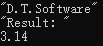

# 1. 文件类型

- Qt中将文件类型分为 <font color=red>**2**</font> 大类
    - <font color=red>文本文件</font>
        - 文件内容是<font color=red>可读的</font>文本字符
    - <font color=red>数据文件</font>
        - 文件内容是直接的<font color=red>二进制数据</font>

- `QFile`直接支持文本文件和数据文件的读写
    - `qint64 read(char *data, qint64 maxSize)`
    - `QByteArray read(qint64 maxSize)`
    - `qint64 write(const char *data, qint64 maxSize)`
    - `qint64 write(const QByteArray &byteArray)`

    > 在`QFile`看来, 文本文件和数据文件没有区别

- 思考
    如何将一个<font color=red>浮点数据</font>写入<font color=red>文本文件</font>和<font color=red>数据文件</font>？
    > 下面实验

# 2. 编程实验 直接使用QFile读写
实验目录：[33-1](vx_attachments\033_Text_and_data_streams\33-1)
创建控制台工程

使用QFile进行数据或文本的读写, 功能上是可行的, 但是不方便的地方在于类型转化。不同的数据必须想办法转化成字节数据，否则无法调用`QFile`的`read`和`write`函数。

```cpp
file.write(dt.toStdString().c_str()); /* 将QString数据转为直接的二进制数组 */
file.write(reinterpret_cast<char*>(&value), sizeof(value)); /* 将其转换为字节类型的数据 */

dt = QString(file.read(12)); /* "D.T.Software" */
file.read(reinterpret_cast<char*>(&value), sizeof(value));
```
> 下面讲解如何简化

# 3. 文本流和数据流
- Qt提供<font color=red>辅助类</font>简化了<font color=red>文本文件</font>/<font color=red>二进制数据文件</font>的读写
    - `QTextStream`
        - 写入的数据全部<font color=red>转换为可读文本</font>
        > 通过这个类也可以从一个文本文件里边将读出来的数据全部转换为可读的文本
    - `QDataStream`
        - 写入的数据根据类型<font color=red>转换为二进制数据</font>
        > 这个类用于简化二进制数据的读写操作，这个类的主要作用是可以直接将程序中的变量以二进制的形式写入到IO设备中，并且也能通过它轻易地将IO设备中的数据读取到我们的程序里边，并且读取成功之后就是我们所需要的数据类型的变量了。

- IO设备辅助类的使用方式
    > 使用`QFile`这种设备进行讲解，其他IO设备一样适用。

    ```cpp
    /* 1. 创建QFile文件对象file */
    /* 2. 使用file对象打开文件 */
    /* 3. 将数据写入文件 */
    QXXXXStream out(&file);

    out << QString("D.T.Software"); /* 字符串类型的数据 */
    out << QString("Result: ") << 3.14; /* double类型的数据 */

    /* 4. 将数据从文件中读出 */
    QXXXXStream in(&file);

    in >> dt;     /* QString dt; */
    in >> reslut; /* QString result; */
    in >> value;  /* double value; */
    ```

# 4. 编程实验 使用文件辅助类读写
实验目录：[33-2](vx_attachments\033_Text_and_data_streams\33-2)
创建控制台工程

- `QTextStream`
- `QDataStream`
    > 打印 :
    > 
    > 文本查看:
    > 
    > 二进制查看:
    > 

# 5. 数据流文件的版本信息
- 不同Qt版本的<font color=red>数据流文件格式</font>可能不同
    ```c
    void setVersion(int v) /* 设置读写版本号 */
    int version() const    /* 获取读写版本号 */
    ```
    > <font color=red>当数据流文件可能在不同版本的Qt程序间传递数据时，需要考虑版本问题 !!!</font>
    > `QDataStream::setVersion(QDataStream::Qt_4_7);`
    > 升级QT版本的时候需注意此项

# 6. 小结
- Qt 中的文件辅助类用于方便读写操作
- `QTextStream` 用于<font color=red>文本数据</font>的快速读写
- `QDataStream` 用于<font color=red>二进制数据</font>的快速读写
- `QDataStream` 的文件格式与 Qt 版本相关
- 数据格式文件<font color=red>在程序间传递时</font>，<font color=red>需要考虑版本问题</font>
