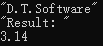
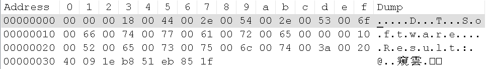

# 1. 文件类型

- Qt中将文件类型分为 <font color=red>2</font> 大类
    - <font color=red>文本文件</font>
        - 文件内容是<font color=red>可读的</font>文本字符
    - <font color=red>数据文件</font>
        - 文件内容是直接的<font color=red>二进制数据</font>

- QFile直接支持文本文件和数据文件的读写

    ```c
    - qint64 read(char* data, qint64 maxSize)
    - QByteArray read(qint64 maxSize)
    - qint64 write(const char* data, qint64 maxSize)
    - qint64 write(const QByteArray& byteArray)
    ```
    > 在QFile看来, 文本文件和数据文件没有区别

- 思考
    如何将一个<font color=red>浮点数据</font>写入<font color=red>文本文件</font>和<font color=red>数据文件</font>？

# 2. 编程实验 直接使用QFile读写
实验目录：[xxx](vx_attachments\xxx)

使用QFile进行数据或文本的读写, 功能上是可行的, 但是不方便的地方在于类型转化

```cp
file.write(dt.toStdString().c_str()); // 将QString数据转为直接的二进制数据
file.write(reinterpret_cast<char*>(&value), sizeof(value)); // 将其转换为字节类型的数据

dt = QString(file.read(12)); /* "D.T.Software" */
file.read(reinterpret_cast<char*>(&value), sizeof(value));
```

# 3. 文本流和数据流
- Qt提供辅助类简化了<font color=red>文本文件</font>/<font color=red>数据文件</font>的读写
    - <font color=red>QTextStream</font>
        - 写入的数据全部<font color=red>转换为可读文本</font>
    - <font color=red>QDataStream</font>
        - 写入的数据根据类型<font color=red>转换为二进制数据</font>

- IO设备辅助类的使用方式

    ```cp
    // 1. 创建QFile文件对象file
    // 2. 使用file对象打开文件
    // 3. 将数据写入文件
    QXXXXStream out(&file);

    out << QString("D.T.Software");
    out << QString("Result: ") << 3.14;

    // 4. 将数据从文件中读出
    QXXXXStream in(&file);

    in >> dt;     // QString dt;
    in >> reslut; // QString result;
    in >> value;  // double value;
    ```

# 4. 编程实验 使用文件辅助类读写
实验目录：[xxx](vx_attachments\xxx)

# 5. 数据流文件的版本信息
- 不同Qt版本的<font color=red>数据流文件格式</font>可能不同
    ```c
    void setVersion(int v) // 设置读写版本号
    int version() const    //获取读写版本号
    ```
    > <font color=red>当数据流文件可能在不同版本的Qt程序间传递数据时，需要考虑版本问题 !!!</font>
    > 课程QT4.7版本的数据流文件格式如下
    > 打印 :
    > 
    > 文本查看:
    > 
    > 二进制查看:
    > 

# 6. 小结
- Qt 中的文件辅助类用于方便读写操作
- <font color=red>QTextStream</font> 用于<font color=red>文本数据</font>的快速读写
- <font color=red>QDataStream</font> 用于<font color=red>二进制数据</font>的快速读写
- <font color=red>QDataStream</font> 的文件格式与 Qt 版本相关
- 数据格式文件<font color=red>在程序间传递时</font>，<font color=red>需要考虑版本问题</font>
