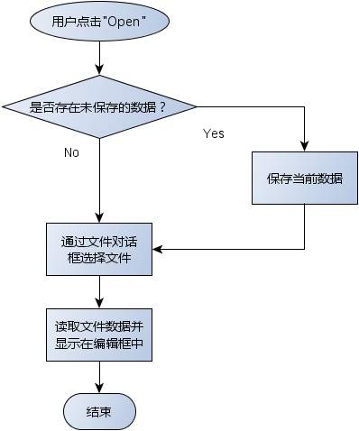
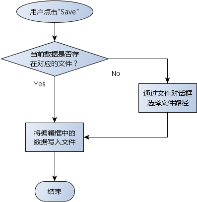
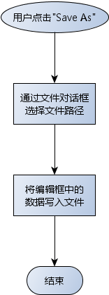

# 1. QAction 的信号
- `QAction` 被点击之后会产生一个triggered信号
    - 通过信号与槽的机制能够捕捉对 `QAction` 对象的操作
    - 项目中可以将多个信号映射到同一个槽函数

	```cpp
	connect(action,
        	SIGNAL(triggered()),
        	this,
        	SLOT(slot_function()));
	```

# 2. 文件打开操作


# 3. 文件保存操作
定义成员变量 <font color=red>m_filePath</font>, 用于标记数据来源。

> 将数据源显示在标题栏中。

# 4. 文件另存为操作


# 5. 编程实验 文本编辑器的数据存取
实验目录：[NotePad](vx_attachments\035_Data_access_in_text_editor\NotePad)
UI与工程文件分离

# 6. 小结
- Qt项目中尽量将<font color=red>界面代码</font>与<font color=red>功能代码</font>分离开
- Qt项目开发时尽量<font color=red>复用平台中提供的相关组件</font>
- Qt项目中的多数情况都是<font color=red>编写相应的槽函数</font>
    - 槽函数用于相应用户操作
    - 槽函数是具体功能的触发点

# 7. 遗留
思考：如何判断是否存在未保存的数据？
> bug：打开一个新文件，会在没有提示的情况下将编辑过的窗口清空并显示新文件内容
