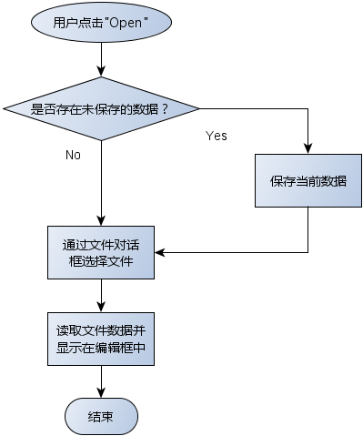
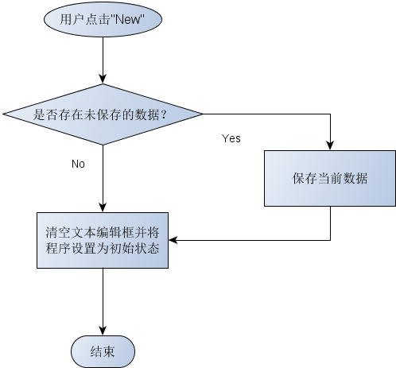

# 1. 思考
如何判断是否存在未保存的数据？
> 当数据发生改变时, 文本框应该知道

# 2. QPIainTextEdit 中的信号
- `QPIainTextEdit` 能够触发与编辑操作相关的信号
```cpp
void textChanged() /* 字符发生变化时触发 */
void copyAvailable(bool)
void cursorPositionChanged()
void redoAvailable(bool)
void undoAvailable(bool)
```
> 此节使用 `textChanged()` 信号。

- 解决方案
    1. 定义槽函数 `void onTextChanged()`
    2. 映射 `textChanged()` 到槽函数
    3. 定义成员变量 `bool m_isTextChanged = false;`
    4. 文本框中的字符发生变化时: `m_isTextChanged = true;`
    5. 当 `m_isTextChanged` 为<font color=red>真</font>，<font color=red>则存在未保存的数据</font>

# 3. 编程实验 判断未保存的数据
实验目录：[NotePad](vx_attachments\036_Functional_interaction_in_text_editor\NotePad)

- 文件打开操作


- 文件新建操作


# 4. 小结
- 文本编辑组件能够<font color=red>触发与编辑操作相关的信号</font>
- `textChanged()` 信号能够用于检测数据变化
- 文本编辑器项目中需要<font color=red>设置状态变量</font>
- <font color=red>功能间的交互通过状态变量完成</font>