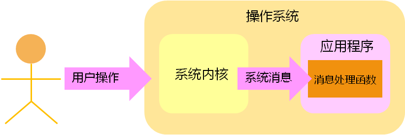
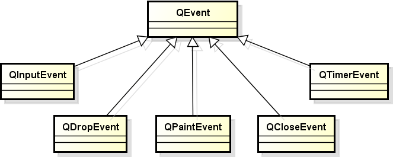
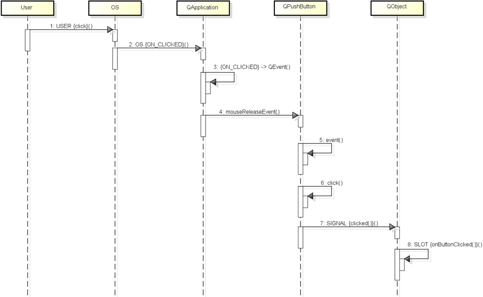
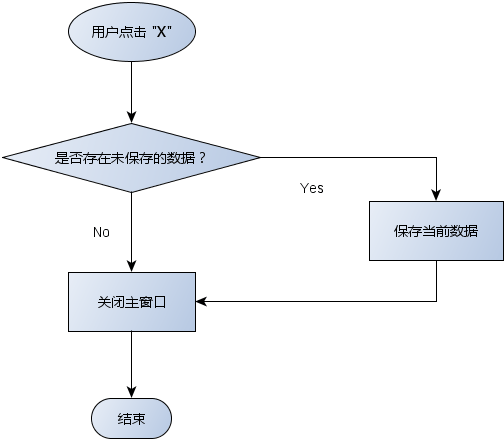
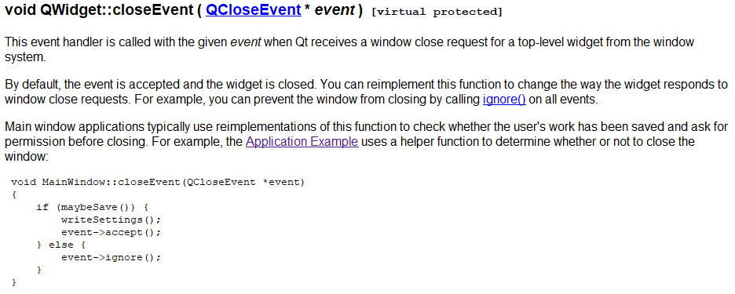

# 1. GUI程序原理回顾
- 图形界面应用程序的消息处理模型
    
    > 在操作系统的角度 : 用户的操作会产生消息, 消息发送到应用程序之后, 会调用对应的消息处理函数.
    > 在QT平台的角度 : 当用户操作时, 会产生一个信号, 进而会调用与信号关联的槽函数.
    > 系统消息和信号似乎是类似的, 实质上它们是完全不同的, 当QT应用程序接收到系统消息时后, 会做一次转换, 转换成QT内部的信号

- 思考
    操作系统发送的<font color=blue>消息</font>如何转变成<font color=red>Qt信号</font> ？

# 2. Qt中的事件处理
- Qt平台将系统产生的消息转换为 Qt 事件
    - Qt事件是一个 <font color=#d0d>QEvent</font> 的对象
    - Qt事件用于<font color=red>描述程序内部或外部发生的动作</font>
        > QT中的事件是用来代表操作系统的消息的, 每个操作系统的消息对应QT平台中的一个事件
    - 任意的 <font color=#d0d>QObject</font> 对象都具备事件处理的能力
        > QT事件产生后, 就需要被处理, 在QT里边QT事件需要被一个QObject对象来处理

    
    > QInputEvent : 输入事件, 用来代表用户的输入操作
    > QDropEvent : 用来描述用户拖拽动作的事件
    > QPaintEvent : 用来描述操作系统绘制GUI界面的动作
    > QCloseEvent : 用户掉级对话框或主窗口的关闭按钮时, 会产生一个系统消息,这个系统消息映射到QT事件时, 会得到一个QCloseEvent的对象
    > QTimerEvent : 计时器事件

- GUI应用程序的事件处理方式 ( 消息如何转化成QT信号的?  : 通过事件处理来转变的 )
    1. Qt 事件产生后立即被<font color=blue>分发到 QWidget 对象</font>
        > 当 QT 的 GUI 应用程序被用户操作时, 会产生一个系统消息, 这个系统消息会被发送到QT应用程序上去, QT应用程序接收到这个消息后, 就会产生一个QT事件
    2. QWidget 中的 <font color=red>event(QEvent*)</font> 进行事件处理
        > 比如我们点击一个按钮, 相关的事件就会发送到按钮对象(也是个QWidget), 按钮对象中的event成员函数就会被调用, 来进行事件的处理, 可以说event成员函数是事件处理的入口.
    3. event() 根据事件类型<font color=#d0d>调用不同的事件处理函数(子函数)</font>
        > 事件类型 : 操作系统发过来的消息类型时各种各样的, 既然这些系统消息是一一对应到QT事件的, 必然的QT事件的类型就各不相同, 因此在event成员函数的内部就要判断事件的类型.
    4. 在事件处理函数中<font color=green>发送Qt中预定义的信号</font>
        > 在事件处理子函数中要做的事情, 一方面是关于界面更新的事情, 还有更重要的是发送QT里边预定义的信号, 后面的事情就是我们熟知的 : 信号发出去, 关联的槽函数就会被调用.
    5. <font color=blue>调用信号关联的槽函数</font>

- 场景分析 : 按钮点击


> 首先, 用户的动作变成操作系统消息, 操作系统消息变成QT事件对象, QT事件对象被event函数处理, event函数内部调用子函数click()来处理, 子函数内部触发一个信号, 进而槽函数就会被调用.

- <font color=#d0d>QPushButton</font> 事件处理分析
    1. 接收到鼠标事件
    2. 调用 event(<font color=#d0d>QEvent</font>*) 成员函数
    3. 调用 mouseReleaseEvent(<font color=#d0d>QMouseEvent</font>*) 成员函数
    4. 调用 <font color=red>click()</font> 成员函数
    5. 触发信号 <font color=blue>SIGNAL(clicked())</font>

# 3. 编程实验 自定义事件处理函数

 c++ 语法, 构造函数后面单冒号 : 初始化成员

因为重写了事件处理函数, 且重写的函数未发送信号, 因此即使connect了信号与槽, 也不会执行槽函数

- 结论
    - QT平台内部是通过事件处理来产生信号的, 是通过事件处理来讲操作系统发出来的消息转变为QT内部的信号的, 如果我们重写了事件处理函数, 就能改变这个行为, 就有可能预期的信号没有出现的情况.
    - 在实际的工程开发里边, 究竟要不要重写事件处理函数, 必须好好斟酌.

- 事件 (<font color=green>QEvent</font>) 和信号 (<font color=red>SIGNAL</font>) 不同
    - <font color=#d0d>事件由具体对象进行处理</font>
        > 事件 : 描述操作系统所发出的消息的, 事件产生之后, 需要被对象来处理
    - <font color=#d0d>信号由具体对象主动产生</font>
        > 在事件处理函数被调用的时候产生
        > 前面的实验可以看到 : 我们可以重写事件处理函数, 从而不产生信号, 因此事件和信号截然不同
    - <font color=blue>改写事件处理函数可能导致程序行为发生改变</font>
        > 比如前面的实验, 重写mouseReleaseEvent事件处理函数后, 若工作未做到位,可能按钮点击后弹不起来
    - <font color=blue>信号是否存在对应的槽函数不会改变程序行为</font>
        > 若没有编写按钮点击信号的槽函数, 对程序的行为或外观,不会有改变
    - <font color=#d0d>一般而言</font>，信号在具体的事件处理函数中产生

# 4. 事件处理的应用 - 文本编辑器中的关闭操作
- 问题 : 点击关闭时, 数据不会提示保存
- 文本编辑器中的<font color=blue>关闭操作</font>


# 5. [<u>编程实验 文本编辑器的关闭操作</u>](code/038_Event_handling_in_Qt_1)
1. 打开帮助, 搜索 QMainWindow，仅有下面的信号
```
Signals
void iconSizeChanged ( const QSize & iconSize )
void toolButtonStyleChanged ( Qt::ToolButtonStyle toolButtonStyle )
```

2. QMainWindow 是继承 QWidget, 查看 QWidget 的信号，仅有下面的信号
```
Signals
void customContextMenuRequested ( const QPoint & pos )
```

3. 因此可知，没有可使用的信号

4. 信号解决不了的问题， 我们可以试试重写事件处理函数, 往下找 QWidget, 可发现
```
Protected Functions
virtual void closeEvent ( QCloseEvent * event )
```

5. 进入查看

> 当我们的窗口被关闭的时候,这个事件处理函数就会被调用, 可基于帮助中的提示修改代码

# 6. 小结
- Qt中的事件 (<font color=#d0d>QEvent</font>) 和信号 (<font color=red>SIGNAL</font>) 不同
- 事件由 <font color=#d0d>QObject</font> 的对象进行处理
- 信号由 <font color=#d0d>QObject</font> 对象触发
- <font color=blue>重写事件处理函数可能改变程序行为</font>
- 信号的触发不会对程序行为造成影响
- <font color=#d0d>事件处理是在实际工程开发中的应用非常普遍</font>

# 7. to be continued
- 事件处理函数的重写步骤还是比较繁琐的, 我们有办法可以自定义事件处理
