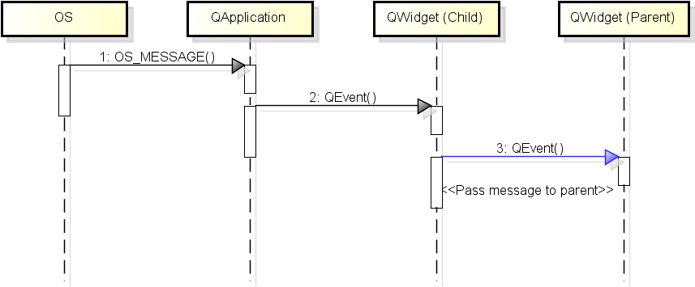
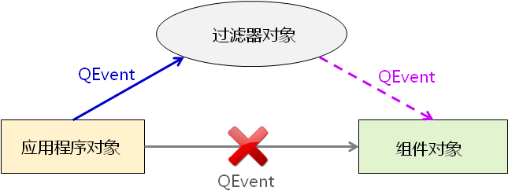

# 1. Qt中的事件处理
- 事件的传递过程

> - 事件被<font color=red>组件对象</font>处理后<font color=red>可能传递</font>到其<font color=red>父组件对象</font>
> - 操作系统在检测到用户的动作时，就会产生一条系统消息，这条系统消息就会发送到当前用户正在使用的QT应用程序上，QT应用程序收到了系统消息，会做一个翻译的工作，将系统消息翻译成一个对应的QT事件对象，并且将这个QT事件对象分发下去，分发到当前用户正在操作的窗口部件上去，这个窗口部件是一个QWidget子类的对象，当这个QWidget对象收到这个事件之后，就会调用`QEvent`事件处理函数，这个事件处理函数又会调用其他的子函数来进行事件的具体处理。<font color=red>处理完之后</font>，参考图中的蓝色箭头，会将当前的事件传送到它的父组件对象上去。注意的是，事件在被组件处理之后，只是可能传递到父组件对象，这个传递不是必须的，也就是说有一些事件对象在被处理完之后会被传递到当前对象的父组件对象那里去再进行处理，而另一些事件对象在处理完之后就完事了，不会再进行事件的传递。
> - 在工程开发过程中这一点是非常重要的，操作系统会检测到用户的各种动作，而用户的动作肯定是不相同的，因此，发送的系统消息就是成百上千的，那么每一种系统消息会对应地被转换成一个QT事件，那也就意味着，QT事件也是成百上千的，这也就说明了这些不同的事件处理的方式可能是不同的，没有办法用统一的方法来处理不同的事件，我们必须分门别类地处理，有一些事件在处理完之后就需要父组件对象再处理一次，而另一些事件在处理完之后，就处理完了，不需进行事件的传递。

- `QEvent`中的关键成员函数
    - `void ignore();`
        - 接收者<font color=red>忽略当前事件</font>，<font color=red>事件可能传递给父组件</font>
    - `void accept();`
        - 接收者<font color=red>期望处理当前事件</font>
    - `bool isAccepted();`
        - <font color=red>判断当前事件是否被处理</font>

    > - `QEvent`是所有事件类的父类
    > - 这三个成员函数其实在操作一个标志位，这个标志位就用于标记当前的事件是否被处理。在我们自定义事件处理函数的时候是非常有用的。
    > - 我们自定义了事件处理函数之后，就说明我们需要自己来做事件的处理，那么处理了之后需不需要QT这个平台（或者说父组件）再来处理一次这个事件？如果说需要，我们就可以调用`void ignore();`这个成员函数，调用之后，在QT这个平台看来就是这个事件没有被处理；`void accept();`就代表我们自己写了事件处理函数，并且我们自己处理了这个事件，不需要其他人再来处理了（这只是针对大多数事件，当然也不排除有一些特殊的事件即便你调用了accept成员函数，父组件对象依旧会再处理一次）。

# 2. 编程实验 事件处理的顺序
实验目录：[39-1](vx_attachments\039_Event_handling_in_Qt_2\39-1)
`ignore();`函数测试。
Qt 应用程序有严格的事件处理顺序
Qt 事件在处理后可能传递给父组件对象

# 3. Qt中的事件过滤器
- Qt中的<font color=red>事件过滤器</font>
    - 事件过滤器可以<font color=red>对其他组件接收到的事件进行监控</font>
    	> 监控的意义在于我们接收到这个事件之后可以将其没收，没收之后我们就可以定制出一些非常有用的GUI效果。
    - 任意的 `QObject` 对象都可以作为事件过滤器使用
    - 事件过滤器对象<font color=red>需要重写</font> `eventFilter()` 函数

- 组件通过 `installEventFilter()` 函数安装事件过滤器
    - 事件过滤器<font color=red>在组件之前接收到事件</font>
    - 事件过滤器能够<font color=red>决定是否将事件转发到组件对象</font>

	

- 事件过滤器的典型实现
重写函数
```cpp
/* 返回true表示事件已经处理，无需传递给obj , */
/* 返回false则正常传递到obj */
bool Widget::eventFilter(QObject *obj, QEvent *e)
{
    if ( /* 根据obj判断对象 */ ) { // 判断当前的obj指针指向的是不是我们感兴趣的组件
        if ( /* 根据 e->type() 判断事件 */ ) { // 判断当前的事件是不是我们感兴趣的事件
            /* 事件处理逻辑 */
        }
    }
    /* 调用父类中的同名函数 */
    return QWidget::eventFilter(obj, e);
}
```
> 第一个参数`obj`代表当前组件，也就是说如果没有安装事件过滤器对象，事件`e`应该直接发到组件对象`obj`上去。由于现在安装了事件过滤器对象，因此情形发生了改变，那么事件过滤对象的`eventFilter`成员函数就会被调用。

# 4. 编程实验 事件过滤器的使用
实验目录：[39-2](vx_attachments\039_Event_handling_in_Qt_2\39-2)
事件过滤器可对事件进行没收和转发。

# 5. 小结
- Qt 应用程序有<font color=red>严格的事件处理顺序</font>
- Qt 事件在处理后<font color=red>可能</font>传递给父组件对象
- 可以通过`installEventFilter()`函数安装事件过滤器
- 事件过滤器可以<font color=red>对其他组件接收到的事件进行监控</font>
- 事件过滤器能够<font color=red>决定是否将事件转发到组件对象</font>
