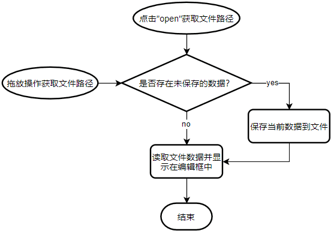

# 1. Qt中的拖放事件
- 拖放一个文件进入窗口时将触发拖放事件
- 每一个`QWidget`对象都能够处理拖放事件
- 拖放事件的处理函数为
    - `void dragEnterEvent(QDragEnterEvent *e); // 拖`
    - `void dropEvent(QDropEvent *e); // 放`

# 2. QMimeData
- 拖放事件中的 `QMimeData`（数组）
    - `QMimeData` 是 Qt 中的多媒体数据类
    - 拖放事件通过 `QMimeData` 对象传递数据
    - `QMimeData` 支持多种不同类型的多媒体数据

    > `MIME`是一种多媒体数据的描述方式，这种描述方式起先是在邮件附件里边用的多，由于这种描述方式比较好，因此在一些其他非邮件类型的应用程序里边也采用了这样的方法。

- 常用 `MIME` 类型数据处理函数

|      测试函数      |   获取函数   |    设置函数     |      MIME类型       |
| ----------------- | ----------- | -------------- | ------------------- |
| hasText()         | text()      | setText()      | text/plain          |
| hasHtml()         | html()      | setHtml()      | text/html           |
| hasUrls() // 路径 | urls()      | setUrls()      | text/url-list       |
| hasImage()        | imageData() | setImageData() | image/*             |
| hasColor          | colorData() | setColorData   | application/x-color |

- 自定义拖放事件的步骤
	1. 对接收拖放事件的对象调用`setAcceptDrops`成员函数
		> 设置了这个成员函数代表当前的这个对象可以去接收拖放事件。在默认情况下大多数QWidget对象是不接受拖放事件的，因此说要哪一个QWidget来接收拖放事件就需要调用这个成员函数
	2. 重写 '拖'`dragEnterEvent` 事件处理函数并判断`MIME`类型
    		• 期望数据：`e->acceptProposedAction();`
    		• 其它数据：`e->ignore();`
	3. 重写 '放' `dropEvent` 事件处理函数并判断`MIME`类型
    		• 期望数据：从事件对象中获取`MIME`数据并处理
    		• 其它数据：`e->ignore();`

# 3. 编程实验 拖放事件初探
实验目录：[40-1](vx_attachments\040_Anatomy_of_drag_event\40-1)

# 4. 文本编辑器中的拖放事件
- 文本编辑器中的拖放操作

- 解决方案
    - 调用主窗口对象的 `setAcceptDrops` 成员函数
    - 重写 `dragEnterEvent` 函数并判断 `MIME` 类型
    - 重写 `dropEvent` 函数判断 `MIME` 类型后打开文件

# 5. 编程实验 文本编辑器中的拖放事件
实验目录：[NotePad](vx_attachments\040_Anatomy_of_drag_event\NotePad)

# 6. 小结
- `QWidget`对象都能够处理拖放事件
- 自定义拖放事件的方法
    1. 调用事件接收对象的`setAcceptDrops`成员函数
    2. 重写`dragEnterEvent`函数并判断 `MIME` 类型
    3. 重写`dropEvent`函数判断 `MIME` 类型后进行事件处理
