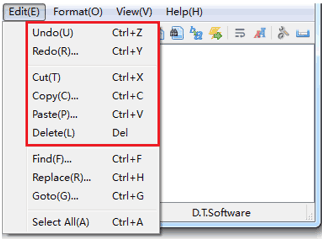
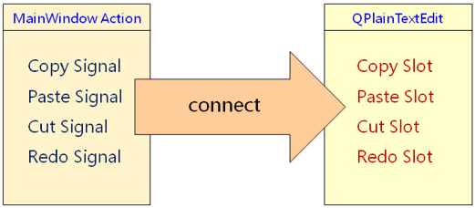
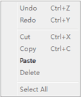

# 1. 编辑交互功能
- 编辑器中的<font color=red>常规编辑交互功能</font>
    - 复制 (Copy)
    - 粘贴 (Paste)
    - 剪切 (Cut)
    - 撤销 (Undo)
    - 重做 (Redo)
    - 删除 (Delete)

    

- `QPlainTextEdit`提供了丰富的交互功能接口
    - `Public Slots`
    ```cpp
    void appendHtml(const QString &html)
    void appendPlainText(const QString &text)
    void centerCursor()
    void clear()
    void copy()
    void cut()
    void insertPlainText(const QString &text)
    void paste()
    void redo()
    void selectAll()
    void setPlainText(const QString & text)
    void undo()
    ```
    - `Signals`
    ```cpp
    void blockCountChanqed(int newBlockCount)
    void copyAvailable(bool yes)
    void cursorPositionChanqed()
    void modificationChanqed(bool changed)
    void redoAvailable(bool available)
    void selectionChanqed()
    void textChanqed()
    void undoAvailable(bool available)
    void updateRequest(const QRect &red, int dy)
    ```
- 信号与槽的连接
	

# 2. 编程实验 基本编辑功能实现
实验目录：[NotePad](vx_attachments\041_Implementation_of_editing_interactive_functions\NotePad)

# 3. 文本编辑器中的界面状态
- 文本编辑器中的<font color=red>界面状态</font>
    - 不是任何时候都能够进行
        - 复制，粘贴
        - 撤销，重做

        

    > 如何维护文本编辑器的界面状态？在实际的产品开发里边，很多情况下面都在做界面状态的维护工作，界面状态的维护其实是非常复杂的。

- `QPIainTextEdit`能够发送与界面状态相关的信号
    ```cpp
    void copyAvailable(bool yes)
    void redoAvailable(bool available)
    void undoAvailable(bool available)
    void cursorPositionChanged()
    ```
    > 我们需要做的仅仅是连接这些信号到槽函数，然后再槽函数里边更新界面的状态就行了，我们不需要定义数据结构来记录界面的状态，仅仅需要根据状态里边携带的标志位来更新界面的信息就可以了。

- 实现步骤
    1. 连接界面状态信号到<font color=red>自定义槽函数</font>
    2. 在槽函数里边通过文本信息找到对应的 `QAction` 对象
        > 比方说我们需要通过一个copy字符串来找到与拷贝相关的 `QAction` 对象。
    3. 根据信号标志设置 `QAction` 对象的界面状态
        >  根据信号里边带的标志位来设置这个 `QAction` 对象是不是可用。

# 4. 编程实验 界面状态更新
实验目录：[NotePad](vx_attachments\041_Implementation_of_editing_interactive_functions\NotePad)

# 5. 小结
- `QPIainTextEdit` 封装了常用的文本编辑功能
- 可以将信号直接连接到 `QPIainTextEdit` 的公有槽函数
- 界面状态是 GUI 开发的<font color=red>重点</font>和<font color=red>难点</font>
- Qt 中<font color=red>组件的状态信号</font>能够简化界面状态的维护
- 主窗口中的组件可以<font color=red>通过遍历的方式找回</font>
