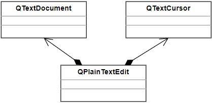
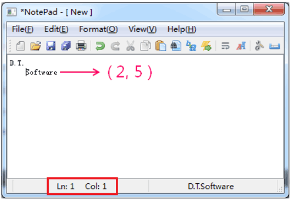
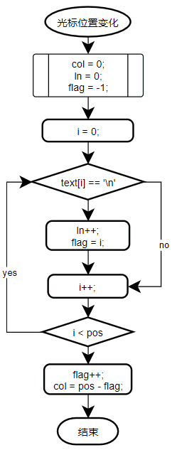

# 1. 文本编辑器中的打印
- `QPIainTextEdit` 内部的文档结构
    - `QPIainTextEdit` 通过 `QTextDocument` 对象存储文本数据
    - `QPIainTextEdit` 本身只负责界面形态的显示

    

- `QTextDocument` 是表示文本以及文本属性的数据类
    - 设置文本的属性：排版，字体，标题，等
    - 获取文本参数：行数，文本宽度，文本信息，等
    - 实现标准操作：撤销，重做，查找，打印，等
    - ...

- 打印功能的实现步骤
    1. 连接 `QAction` 打印对象的信号到槽函数
    2. 在槽函数中定义 `QPrintDialog` 对象
    3. 根据用户选择获取 `QPrinter` 对象
    4. 通过 `QTextDocument` 对象进行打印

# 2. 编程实验 文本编辑器中的打印功能
实验目录：[NotePad](vx_attachments\042_Text_printing_and_cursor_positioning\NotePad)

# 3. 光标位置的计算
问题：如何计算编辑框中光标的位置？

- 思路
    - 文本框对象的内部包含了 `QTextCursor` 对象
    - 通过 `position()` 成员函数获取当前光标的字符位置
    - 根据光标的字符位置计算横纵坐标
    - 当光标位置发生变化时进行计算

- 算法流程描述
    思想：
        1. 通过 `'\n'` 字符的个数计算所在行
        2. 通过最后一个 `'\n'` 字符的下标计算所在列
        

# 4. 编程实验 光标位置计算
实验目录：[NotePad](vx_attachments\042_Text_printing_and_cursor_positioning\NotePad)

# 5. 小结
- `QPIainTextEdit` 将数据和界面分开设计
- `QTextDocument` 用于存储数据信息
- `QTextCursor` 用于提供光标相关的信息
- 可以通过光标的字符位置信息计算坐标
