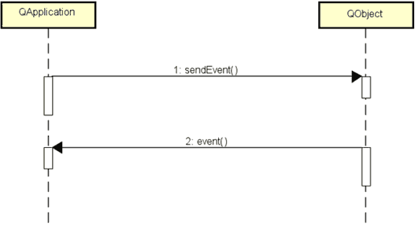
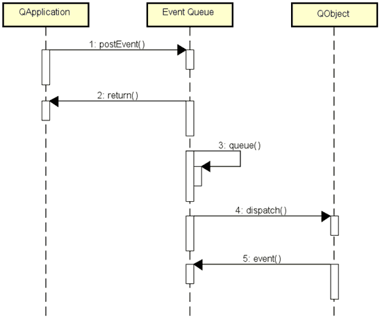
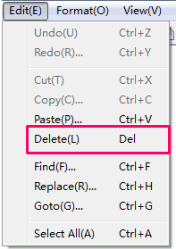

# 1. 在程序中发送事件

> 根据前面学习：事件是QT平台用于描述用户操作的对象。
> 事件对象的由来不只是操作系统带来的，我们也可以在程序里边自主地发送事件对象。

- Qt中可以在程序中自主发送事件
    - 阻塞型事件发送
        - 事件发送后需要等待事件处理完成
    - 非阻塞型事件发送
        - 事件发送后立即返回
        - 事件被发送到事件队列中等待处理

- `QApplication` 类提供了支持事件发送的静态成员函数
    - 阻塞型发送函数：
        - `bool sendEvent(QObject *receiver, QEvent *event);`
    - 非阻塞型发送函数：
        - `void postEvent(QObject *receiver, QEvent *event);`

- 注意事项
    - `sendEvent` 中事件对象的生命期甶 Qt 程序管理
        - 同时支持栈事件对象和堆事件对象的发送（不管事件对象是在哪里创建的，都可以被这个`sendEvent`成员函数所发送）
    - `postEvent` 中事件对象的生命期由 Qt 平台管理
        - 只能发送堆事件对象
        - 事件被处理后由Qt平台销毀

    > 若不遵守，可能程序崩溃。

- 使用`sendEvent`发送事件对象
    

    小贴士 ：
    消息发送过程可以理解为：在`sendEvent()`函数内部直接调用 Qt 对象的 event() 事件处理函数。

- 使用`postEvent`发送事件对象
    

    > dispatch()：分发。

# 2. 编程实验 在程序中发送事件
实验目录：[43-1](vx_attachments\043_Sending_custom_events_1\43-1)

# 3. 文本编辑器中的事件发送
- 菜单栏中删除功能的实现
    1. 定义事件对象 KeyPress
    2. 定义事件对象 KeyRelease
    3. 发送事件 KeyPress
    4. 发送事件 KeyRelease
    

# 4. 编程实验 文本编辑器中的事件发送
实验目录：[NotePad](vx_attachments\043_Sending_custom_events_1\NotePad)

# 5. 小结
- Qt 程序中能够自主的发送系统事件
- `QApplication` 类提供了支持事件发送的成员函数
- `sendEvent()` 发送事件后需要等待事件处理完成
- `postEvent()` 发送事件后立即返回
