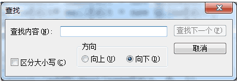
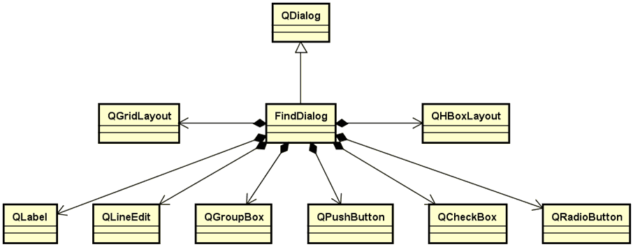
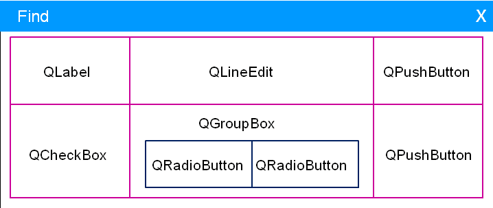

# 1. 查找对话框
- 查找对话框是应用程序中的常用部件
    目标：开发一个可以在不同项目间复用的查找对话框

- 需求
    - 查找对话框需求分析
        - 可复用软件部件
        - 查找文本框中的指定字符串
        - 能够指定查找方向
        - 支持大小写敏感查找 

        

    - 附加需求
        - 点击关闭按钮后隐藏

- 查找对话框的架构与设计
    

- 查找对话框的界面布局
    

# 2. 编程实验 查找对话框界面开发
实验目录：[NotePad](vx_attachments\045_Create_search_dialog\NotePad)
注：QT智能指针`QSharedPointer`的使用-c++深度解析

# 3. 小结
- 查找对话框可以作用一个可复用的软件部件进行开发
- 查找对话框继承自 `QDialog` 类
- 查找对话框的界面通过布局管理器相互嵌套完成
- 查找对话框的设计与实现是GUI学习中的经典范例
