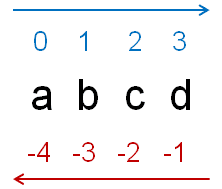
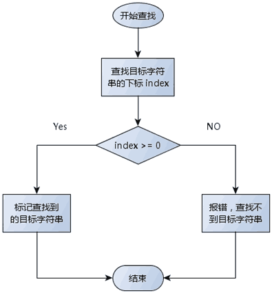
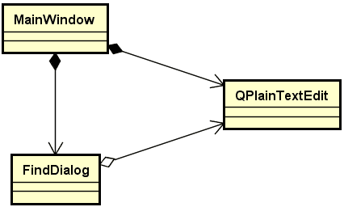

# 1. 查找功能的实现
- 文本查找功能的<font color=red>核心思想</font>
1. 获取<font color=red>当前光标的位置</font>并作为起始点
2. 向后（向前）<font color=red>查找目标第一次出现的位置</font>
3. 通过目标位置以及目标长度在文本框中进行标记

- `QString`类中提供了子串查找的相关函数
    - `indexOf`
        - 从指定位置<font color=red>向后</font>查找目标子串的下标位置
    - `lastIndexOf`
        - 从指定位置<font color=red>向前</font>查找目标子串的下标位置

- `QString`类中查找函数所使用的<font color=red>下标位置</font>


```cpp
QString text = "abcdefcdg";
QString target = "cd";

text.indexOf(target, 1);      // 2
text.lastIndexOf(target, -2); // 6
```

- Qt中的光标信息类`QTextCursor`
    - 文本框中的光标是一个`QTextCursor`对象
    - 所有与光标相关的信息都通过`QTextCursor`描述
        - 如：<font color=red>光标位置，文本选择</font>，等等

	```cpp
	QTextCursor c = mainEditor.textCursor();   // 获取当前光标
	c.setPosition(1);                          // 定位到下标1的位置
	c.setPosition(4, QTextCursor::KeepAnchor); // 文本选择范围[1, 4]
	mainEditor.setTextCursor(c);               // 设置光标信息到文本框
	```

- 查找算法流程图


- `MainWindows` 与 `FindDialog` 之间的关系图


# 2. 编程实验 查找功能的实现
实验目录：[NotePad](vx_attachments\046_Function_realization_of_search_dialog\NotePad)

# 3. 小结
- `QString`中提供了不同的子串查找方式
- `QTextCursor`对象保存了文本框中光标的相关信息
- `QString`对象和`QTextCurosr`对象<font color=red>协作实现查找功能</font>
- 查找对话框与文本框的<font color=red>弱耦合关系</font>满足了可复用的需求
