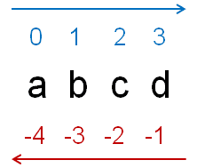

# 1. 查找功能的实现
- 文本查找功能的核心思想
1. 获取当前光标的位置并作为起始点
2. 向后（向前）查找目标第一次出现的位置
3. 通过目标位置以及目标长度在文本框中进行标记

- QString类中提供了子串查找的相关函数
    - indexOf
        - 从指定位置向后查找目标子串的下标位置
    - lastlndexOf
        - 从指定位置向前查找目标子串的下标位置

- QString类中查找函数所使用的下标位置


```c
QString text = "abcdefcdg";
QString target = "cd";

text.indexOf(target, 1);      // 2
text.lastIndexOf(target, -2); // 6
```

- Qt中的光标信息类QTextCursor
    - 文本框中的光标是一个QTextCursor对象
    - 所有与光标相关的信息都通过QTextCursor描述
        - 如：光标位置，文本选择，等等

```c
QTextCursor c = mainEditor.textCursor();   // 获取当前光标
c.setPosition(1);                          // 定位到下标1的位置
c.setPosition(4, QTextCursor::KeepAnchor); // 文本选择范围[1, 4]
mainEditor.setTextCursor(c);               // 设置光标信息到文本框
```

- 查找算法流程图


- MainWindows与FindDialog 之间的关系图


# 2. 编程实验 查找功能的实现
实验目录：[xxx](vx_attachments\xxx)

# 3. 小结
- QString中提供了不同的子串查找方式
- QTextCursor对象保存了文本框中光标的相关信息
- QString对象和QTextCurosr对象协作实现查找功能
- 查找对话框与文本框的弱耦合关系满足了可复用的需求