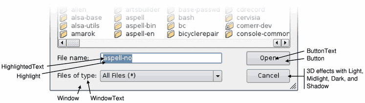

# 1. Qt中的调色板
- `QPalette`类包含了<font color=red>组件状态的颜色组</font>
- `QPalette`对象包含 **<font color=red>3</font>** 个状态的颜色描述
    - 激活颜色组（`Active`）
        - 组件<font color=red>获得焦点</font>使用的颜色搭配方案
    - 非激活颜色组（`Inactive`）
        - 组件<font color=red>失去焦点</font>使用的颜色方案
    - 失效颜色组（`Disabled`）
        - 组件处于<font color=red>不可用状态</font>使用的颜色方案

- `QPalette` 中的颜色组定义了组细节的颜色值
- `QPalette::ColorRole` 中的常量值用于标识组件细节


- 理解Qt中的调色板

|          | WindowText | Highlight | ... | ButtonText |
| -------- | ---------- | --------- | --- | ---------- |
| Active   | black      | blue      | ... | black      |
| Inactive | black      | gray      | ... | black      |
| Disabled | gray       | gray      | ... | gray       |
> 理解：
> 1. 调色板是存储<font color=red>组件颜色信息</font>的数据结构
> 2. 组件外观所<font color=red>使用的颜色都定于调色板中</font>

- 调色板的使用方式

	```cpp
	QPalette p = widget.palette();

	p.setColor(QPalette::Active, QPalette::WindowText, Qt::blue);
	p.setColor(QPalette::Inactive, QPalette::WindowText, Qt::blue);

	widget.setPalette(p);
	```

# 2. 编程实验 Qt中调色板的使用
实验目录：[47-1](vx_attachments\047_Color_palette_in_Qt\47-1)

# 3. 编程实验 查找功能的优化
实验目录：[NotePad](vx_attachments\047_Color_palette_in_Qt\NotePad)

# 4. 小结
- `QPalette` 是 Qt 中<font color=red>标识颜色信息</font>的数据结构
- 窗口组件内部都拥有 `QPalette` 对象
- <font color=red>重新设置组件调色板的值</font>能够改变特定区域的颜色
- `QPalette` 对象是<font color=red>定制组件外观</font>的重要角色
