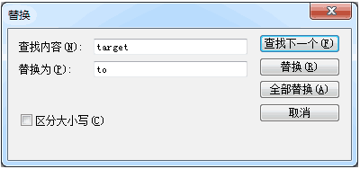
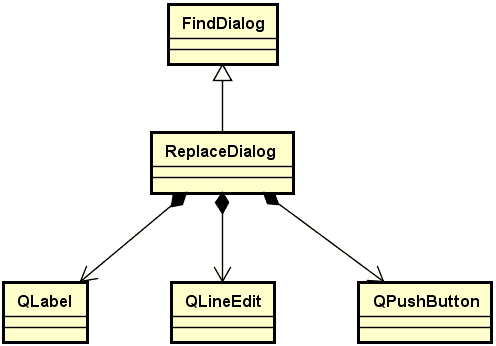
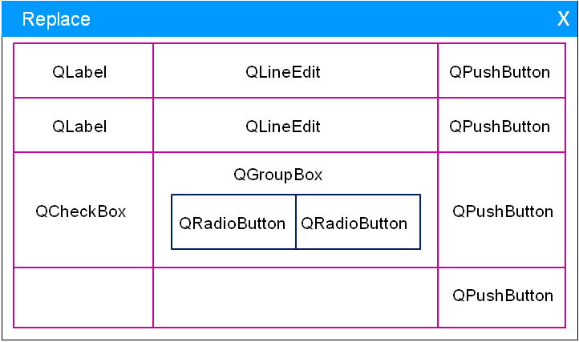
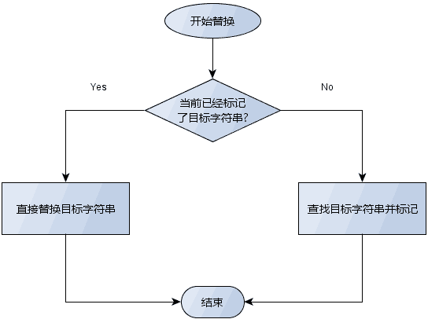
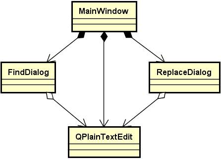

# 1. 替换对话框
- 需求
    - 替换对话框需求分析
        - 可复用软件部件
        - 查找文本框中的指定字符串
        - 替换单个指定字符串
        - 替换所有指定字符串
    - 附加需求
        - 点击关闭按钮后隐藏

    

- 替换对话框的设计与实现

- 替换对话框的界面布局

# 2. 编程实验 替换对话框的创建
实验目录：[NotePad](vx_attachments\048_Design_and_implementation_of_replacement_dialog\NotePad)

- 替换算法流程图

- `Mainwindows` 与 `ReplaceDialog` 之间的关系图

# 3. 编程实验 替换功能的实现
实验目录：[NotePad](vx_attachments\048_Design_and_implementation_of_replacement_dialog\NotePad)

# 4. 小结
- 替换对话框的功能涵盖了查找对话框的功能
- 替换对话框可以继承自查找对话框
- 替换功能的实现是基于查找算法完成的
- 替换对话框是一个可复用的软件部件