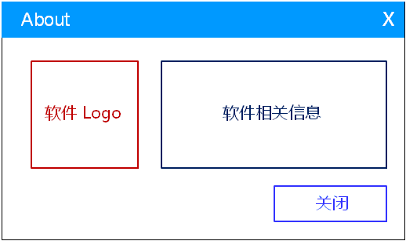

# 1. 关于对话框
- 标准的桌面应用软件都有一个关于对话框
- 关于对话框用于标识软件自身的信息
    - 软件Logo, 项目名, 版本号
    - 开发者信息
    - 版权信息
    - 联系方式
    - 。。。

- 经典设计方案

# 2. 编程实验 关于对话框的创建
实验目录：[NotePad](vx_attachments\050_dialog_of_About\NotePad)

# 3. 开发目标
- [x] 自定义文本编辑框中的字体和大小
- [x] 设置文本编辑框是否自动换行
- [x] 打开外部帮助文件

# 4. 自定义字体及大小
- 实现思路
    - 通过`QFontDialog` 选择字体以及大小
    - 将 `QFont` 对象设置到文本编辑框

# 5. 自动换行
- 实现思路
    - 获取当前文本编辑框的换行模式
    - 将模式进行反转后并进行设置
    - 更新对应 `QAction` 对象的状态

# 6. 打开外部文件
- `QDesktopServices` 提供了一系列桌面开发相关的服务接口
- 通过 `QDesktopServices` 中的成员函数打开帮助文件
    - `QDesktopServices::openUrl (QUrl("path"))`

# 7. 编程实验 项目持续开发
实验目录：[NotePad](vx_attachments\050_dialog_of_About\NotePad)

# 8. 小结
- 关于对话框用于标识软件自身的信息
- 使用 `QFontDialog` 设置文本编辑框的字体
- 设置文本编辑框的自动换行属性
- 通过 `QDesktopServices` 使用桌面环境的系统服务
