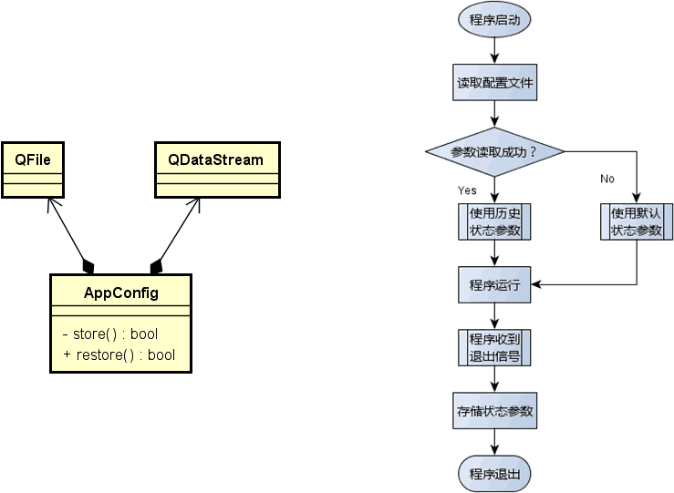

# 1. 程序中的配置文件
- 应用程序在运行后都有一个初始化的状态
- —般而言：
    - 程序的初始状态是最近一次运行退出前的状态

- 问题
    如何保存和恢复程序状态？

- 解决思路
    - 程序退出前保存状态参数到文件（数据库)
    - 程序再次启动时读出状态参数并恢复

- 状态参数的存储方式
    - 文本文件格式（XML, JSon, 等）
    - 轻量级数据库（Access, SQLite, 等）
    - 私有二进制文件格式

- Qt中的解决方案
    - 通过二进制数据流将状态参数直接存储于文件中
    - 优势：
        - 参数的存储和读取简单高效，易于编码实现
        - 最终文件为二进制格式，不易被恶意修改

- 设计与实现
    

# 2. 编程实验 文本编辑器的状态配置
实验目录：[NotePad](vx_attachments\051_Configuration_files_in_the_program\NotePad)

# 3. 小结
- 应用程序中在退出时保存程序状态（用户配置）
- 应用程序启动时恢复最近一次的程序状态
- 可以通过二进制数据流将状态参数直接存储于文件中
- 二进制数据流的方式非常的安全，简单，高效
