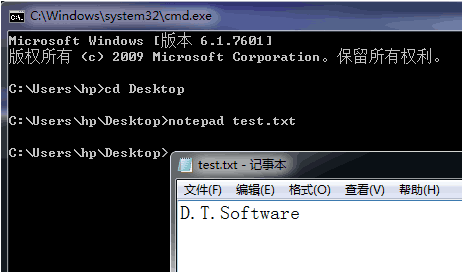
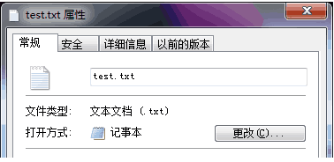

# 1. 主窗口的状态参数
- 主窗口的状态参数
    - 应用程序必须保存和恢复主窗口的状态参数
        - 位置，大小，。。。

- 问题
    什么时候保存主窗口的状态数据？

- 应用程序退出的过程
    1. 收到关闭事件
    2. 执行关闭事件处理函数
    3. 主窗口从屏幕上消失
    4. 主窗口的析构函数执行
    5. ...

- —般而言
    - 应用程序收到关闭事件时进行状态参数的保存
- Qt中的解决方案
    1. 重写关闭事件处理函数
    2. 在关闭事件处理函数中保存状态参数

# 2. 编程实验 主窗口的状态参数
实验目录：[NotePad](vx_attachments\052_Application_of_command_line_parameters\NotePad)

# 3. 命令行参数的应用
- 每一个应用程序都能够接收命令行参数
- 问题
    GUI系统中命令行参数如何传递到应用程序？

- 命令行参数的应用一
    - 传统应用方式
        - 在命令行启动GUI程序时传递参数
        

- 命令行参数的应用二
    - 操作系统关联方式
        - 在文件被双击时，操作系统根据文件后缀选择应用程序
        - 将文件路径作为命令行参数启动应用程序
        

# 4. 编程实验 处理命令行参数
实验目录：[xxx](vx_attachments\xxx)

# 5. 小结
- GUI程序主窗口的相关参数必须保存
- GUI程序在收到关闭事件时保存状态参数
- GUI程序依然能够接收命令行参数
- 操作系统将文件的路径作为命令行参数传递
